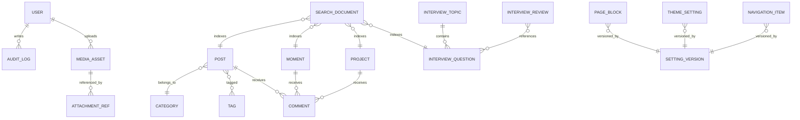
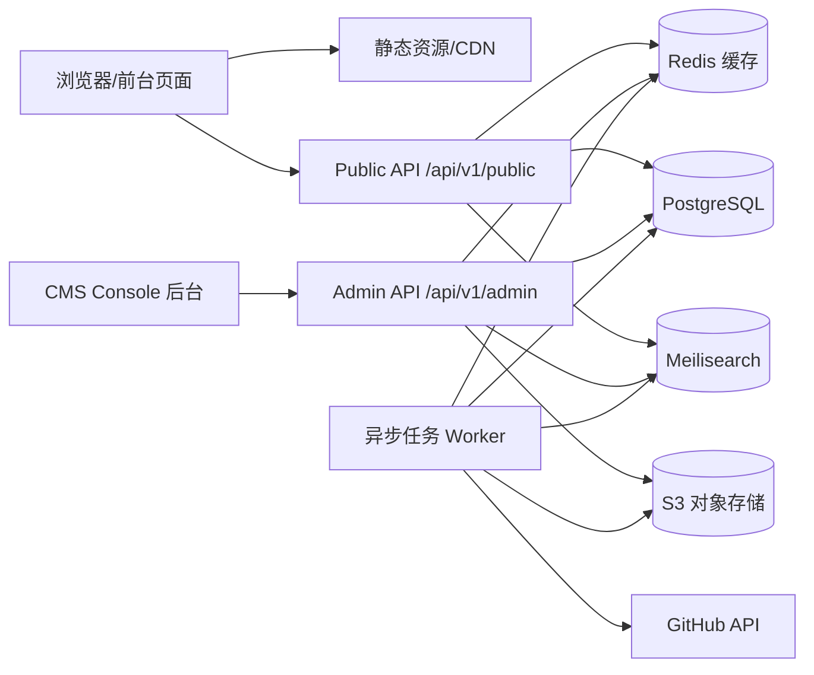

# Joe 个人站专业级后端设计方案

生成日期：2026-08-04

本文档是 Joe 个人站的后端工程蓝图，目标是把当前前端已经形成的首页、瞬间、小记、项目、面试、关于等模块，升级为可在后台完整调节、增删改查、发布审核、配置回滚的专业级 CMS 系统。方案采用 Spring Boot 3、Java 21、PostgreSQL、Redis、Meilisearch、S3 兼容对象存储与独立 CMS Console 后台。

设计参考 Halo 的主题设置、Console 配置、扩展模型和自动 CRUD 思路，但不直接把 Joe 套进 Halo。原因是当前前端已经形成很强的视觉与交互风格，自建 Joe CMS 能更精确地服务现有页面，同时保留未来向插件化、模型扩展、主题设置 DSL 演进的空间。

## 参考资料

- [Halo 主题设置 settings.yaml 文档](https://docs.halo.run/2.19/developer-guide/theme/settings/)

- [Halo 自定义模型与自动 CRUD API 文档](https://docs.halo.run/developer-guide/plugin/api-reference/server/extension/)

- [GitHub GraphQL Users / ContributionsCollection 文档](https://docs.github.com/en/graphql/reference/users)

- [GitHub REST API Rate Limits 文档](https://docs.github.com/en/rest/using-the-rest-api/rate-limits-for-the-rest-api)

- [GitHub REST Contents API 文档](https://docs.github.com/en/rest/repos/contents)

# 当前前端盘点

| 页面 key | 页面 | 当前展示内容 |
| --- | --- | --- |
| home | 首页 | 统计、最新瞬间、项目预览、状态卡、分类入口、GitHub 日历、个人卡片 |
| moments | 瞬间 | 图文碎片、类型过滤、标签、图片、时间线展示 |
| archive | 小记 | 文章列表、分类过滤、本地搜索、GitHub 侧栏、长文入口 |
| projects | 项目 | 项目卡片、进度、封面、路线图、维护规则 |
| interview | 面试 | 面试题库、专题、项目表达、算法题、复盘记录 |
| about | 关于 | 头像、当前状态、技术栈、留言、联系方式 |

当前前端通过 `data-page` 标识页面，通过 `data-text-key` 标识可替换文案，通过 `data-layout-key` 标识可开关布局，通过本地预览服务暴露 `/api/site/texts`、`/api/site/overview`、`/api/projects`、`/api/moments`、`/api/posts`、`/api/github/contributions`、`/api/moyu` 等接口。这些信号说明前端已经天然适合接入一个配置化 CMS，而不是只接传统博客文章接口。

# 设计原则

### 后台驱动前台

前台不再依赖硬编码内容，所有可运营信息都来自公开 API 或静态配置缓存。前端仍保持轻量，后端承担内容治理、权限、审计和发布流程。这条原则会贯穿库表、接口、后台页面和部署方案。落地时不要为了短期开发速度跳过审计、版本和降级，因为个人站虽然规模小，但内容资产会长期积累，一旦后台不可解释，后续维护成本会快速上升。

### 配置即内容

导航、主题、页面文案、卡片顺序、布局开关都视为内容资产，必须有版本、发布、回滚和审计，而不是散落在代码常量里。这条原则会贯穿库表、接口、后台页面和部署方案。落地时不要为了短期开发速度跳过审计、版本和降级，因为个人站虽然规模小，但内容资产会长期积累，一旦后台不可解释，后续维护成本会快速上升。

### 公开端与管理端隔离

公开 API 只读、缓存友好、只暴露已发布内容；管理 API 强认证、强审计、支持草稿和预览。这条原则会贯穿库表、接口、后台页面和部署方案。落地时不要为了短期开发速度跳过审计、版本和降级，因为个人站虽然规模小，但内容资产会长期积累，一旦后台不可解释，后续维护成本会快速上升。

### 渐进复杂度

第一期先保证个人站高质量可维护，后续再开放插件点、多用户协作、模型扩展和自动 CRUD。这条原则会贯穿库表、接口、后台页面和部署方案。落地时不要为了短期开发速度跳过审计、版本和降级，因为个人站虽然规模小，但内容资产会长期积累，一旦后台不可解释，后续维护成本会快速上升。

### 可恢复优先

删除默认软删，配置发布必须可回滚，附件替换保留旧引用，备份恢复覆盖数据库、对象存储索引和站点配置。这条原则会贯穿库表、接口、后台页面和部署方案。落地时不要为了短期开发速度跳过审计、版本和降级，因为个人站虽然规模小，但内容资产会长期积累，一旦后台不可解释，后续维护成本会快速上升。

### 可观察可解释

所有任务、同步、缓存刷新、搜索重建、失败降级都要有后台可见状态，避免个人站变成黑盒。这条原则会贯穿库表、接口、后台页面和部署方案。落地时不要为了短期开发速度跳过审计、版本和降级，因为个人站虽然规模小，但内容资产会长期积累，一旦后台不可解释，后续维护成本会快速上升。

# 总体模块矩阵

| 模块 | 核心模型 | 职责 |
| --- | --- | --- |
| 内容中心 | Post / Moment / Project / Interview | 负责所有可发布内容的生命周期，包括草稿、预览、发布、归档、删除、排序、置顶、标签、分类、SEO 元信息。 |
| 页面装修 | PageBlock / SiteText / ThemeSetting / NavigationItem | 负责把当前前端硬编码文案、导航、hero、背景、布局开关转成后台可编辑配置。 |
| 互动系统 | Comment / Reaction / ViewEvent | 负责评论、回复、点赞、浏览量、审核、反垃圾、匿名访客限流和互动统计。 |
| 搜索系统 | SearchDocument / SearchSyncJob | 负责把文章、项目、瞬间、面试题统一索引到 Meilisearch，并提供前台统一搜索。 |
| 媒体资源 | MediaAsset / MediaVariant / AttachmentRef | 负责上传、裁剪、压缩、对象存储、引用追踪、未使用资源清理。 |
| 集成系统 | GithubContribution / MoyuModule / FeedJob | 负责 GitHub 日历、仓库元信息同步、摸鱼模块、RSS、Sitemap、统计任务。 |
| 系统后台 | User / Role / Permission / AuditLog / BackupJob | 负责登录、RBAC、审计日志、配置版本、备份恢复和系统观测。 |

# ERD 草图

# 数据模型与库表设计

数据库采用 PostgreSQL。所有核心表统一包含 `id`、`created_at`、`updated_at`、必要时包含 `deleted_at`。内容表引入 `status`、`sort_order`、`published_at`，配置表引入 `version` 与 `scope_key`。富文本内容保存 Markdown 原文与安全渲染后的 HTML，渲染结果可以重建，但发布快照要可追溯。

| 表名 | 中文含义 | 关键字段 |
| --- | --- | --- |
| posts | 文章与小记 | id, slug, title, summary, content_md, content_html, category_id, status, pinned, sort_order, cover_asset_id, published_at, created_at, updated_at, deleted_at |
| moments | 瞬间 | id, kind, content, image_asset_id, status, pinned, sort_order, published_at, created_at, updated_at, deleted_at |
| projects | 项目 | id, slug, name, summary, status_text, progress, cover_asset_id, repo_url, demo_url, last_update, status, sort_order |
| interview_topics | 面试专题 | id, slug, title, description, sort_order, visible, created_at, updated_at |
| interview_questions | 面试题 | id, topic_id, title, answer_md, difficulty, source, status, sort_order, reviewed_at |
| interview_reviews | 面试复盘 | id, company_alias, position_name, interview_round, happened_at, result_status, summary_md, improvement_md |
| page_blocks | 页面区块 | id, page_key, block_key, title, subtitle, body, config_json, visible, sort_order, version |
| site_texts | 站点文案 | id, text_key, text_value, locale, description, version, updated_by |
| theme_settings | 主题配置 | id, theme_key, palette_json, background_asset_id, active, version |
| navigation_items | 导航菜单 | id, nav_key, label, href, target, visible, sort_order, permission_expr |
| comments | 评论 | id, target_type, target_id, parent_id, nickname, email_hash, content, status, ip_hash, user_agent_hash |
| reactions | 点赞反应 | id, target_type, target_id, reaction_type, actor_hash, created_at |
| media_assets | 媒体 | id, bucket, object_key, public_url, mime_type, size_bytes, width, height, blurhash, sha256, created_by |
| audit_logs | 审计日志 | id, actor_id, action, resource_type, resource_id, before_json, after_json, ip_hash, created_at |
| setting_versions | 配置版本 | id, scope_key, payload_json, status, version, created_by, published_at |

## 字段治理规则

### posts：文章与小记

`posts` 表承载文章与小记。关键字段为 `id, slug, title, summary, content_md, content_html, category_id, status, pinned, sort_order, cover_asset_id, published_at, created_at, updated_at, deleted_at`。该表的设计重点不是只把字段存进去，而是保证后台能按状态、时间、排序、可见性和引用关系进行管理。所有对前台展示有影响的字段都需要进入审计日志。

字段命名使用 snake_case，接口返回使用 camelCase，由 DTO 层转换。所有 slug 类字段必须唯一、稳定、可人工编辑；如果标题变化，slug 不自动变更，避免破坏外链。涉及用户输入的 Markdown 需要服务端净化，HTML 渲染结果不信任客户端。

### moments：瞬间

`moments` 表承载瞬间。关键字段为 `id, kind, content, image_asset_id, status, pinned, sort_order, published_at, created_at, updated_at, deleted_at`。该表的设计重点不是只把字段存进去，而是保证后台能按状态、时间、排序、可见性和引用关系进行管理。所有对前台展示有影响的字段都需要进入审计日志。

字段命名使用 snake_case，接口返回使用 camelCase，由 DTO 层转换。所有 slug 类字段必须唯一、稳定、可人工编辑；如果标题变化，slug 不自动变更，避免破坏外链。涉及用户输入的 Markdown 需要服务端净化，HTML 渲染结果不信任客户端。

### projects：项目

`projects` 表承载项目。关键字段为 `id, slug, name, summary, status_text, progress, cover_asset_id, repo_url, demo_url, last_update, status, sort_order`。该表的设计重点不是只把字段存进去，而是保证后台能按状态、时间、排序、可见性和引用关系进行管理。所有对前台展示有影响的字段都需要进入审计日志。

字段命名使用 snake_case，接口返回使用 camelCase，由 DTO 层转换。所有 slug 类字段必须唯一、稳定、可人工编辑；如果标题变化，slug 不自动变更，避免破坏外链。涉及用户输入的 Markdown 需要服务端净化，HTML 渲染结果不信任客户端。

### interview_topics：面试专题

`interview_topics` 表承载面试专题。关键字段为 `id, slug, title, description, sort_order, visible, created_at, updated_at`。该表的设计重点不是只把字段存进去，而是保证后台能按状态、时间、排序、可见性和引用关系进行管理。所有对前台展示有影响的字段都需要进入审计日志。

字段命名使用 snake_case，接口返回使用 camelCase，由 DTO 层转换。所有 slug 类字段必须唯一、稳定、可人工编辑；如果标题变化，slug 不自动变更，避免破坏外链。涉及用户输入的 Markdown 需要服务端净化，HTML 渲染结果不信任客户端。

### interview_questions：面试题

`interview_questions` 表承载面试题。关键字段为 `id, topic_id, title, answer_md, difficulty, source, status, sort_order, reviewed_at`。该表的设计重点不是只把字段存进去，而是保证后台能按状态、时间、排序、可见性和引用关系进行管理。所有对前台展示有影响的字段都需要进入审计日志。

字段命名使用 snake_case，接口返回使用 camelCase，由 DTO 层转换。所有 slug 类字段必须唯一、稳定、可人工编辑；如果标题变化，slug 不自动变更，避免破坏外链。涉及用户输入的 Markdown 需要服务端净化，HTML 渲染结果不信任客户端。

### interview_reviews：面试复盘

`interview_reviews` 表承载面试复盘。关键字段为 `id, company_alias, position_name, interview_round, happened_at, result_status, summary_md, improvement_md`。该表的设计重点不是只把字段存进去，而是保证后台能按状态、时间、排序、可见性和引用关系进行管理。所有对前台展示有影响的字段都需要进入审计日志。

字段命名使用 snake_case，接口返回使用 camelCase，由 DTO 层转换。所有 slug 类字段必须唯一、稳定、可人工编辑；如果标题变化，slug 不自动变更，避免破坏外链。涉及用户输入的 Markdown 需要服务端净化，HTML 渲染结果不信任客户端。

### page_blocks：页面区块

`page_blocks` 表承载页面区块。关键字段为 `id, page_key, block_key, title, subtitle, body, config_json, visible, sort_order, version`。该表的设计重点不是只把字段存进去，而是保证后台能按状态、时间、排序、可见性和引用关系进行管理。所有对前台展示有影响的字段都需要进入审计日志。

字段命名使用 snake_case，接口返回使用 camelCase，由 DTO 层转换。所有 slug 类字段必须唯一、稳定、可人工编辑；如果标题变化，slug 不自动变更，避免破坏外链。涉及用户输入的 Markdown 需要服务端净化，HTML 渲染结果不信任客户端。

### site_texts：站点文案

`site_texts` 表承载站点文案。关键字段为 `id, text_key, text_value, locale, description, version, updated_by`。该表的设计重点不是只把字段存进去，而是保证后台能按状态、时间、排序、可见性和引用关系进行管理。所有对前台展示有影响的字段都需要进入审计日志。

字段命名使用 snake_case，接口返回使用 camelCase，由 DTO 层转换。所有 slug 类字段必须唯一、稳定、可人工编辑；如果标题变化，slug 不自动变更，避免破坏外链。涉及用户输入的 Markdown 需要服务端净化，HTML 渲染结果不信任客户端。

### theme_settings：主题配置

`theme_settings` 表承载主题配置。关键字段为 `id, theme_key, palette_json, background_asset_id, active, version`。该表的设计重点不是只把字段存进去，而是保证后台能按状态、时间、排序、可见性和引用关系进行管理。所有对前台展示有影响的字段都需要进入审计日志。

字段命名使用 snake_case，接口返回使用 camelCase，由 DTO 层转换。所有 slug 类字段必须唯一、稳定、可人工编辑；如果标题变化，slug 不自动变更，避免破坏外链。涉及用户输入的 Markdown 需要服务端净化，HTML 渲染结果不信任客户端。

### navigation_items：导航菜单

`navigation_items` 表承载导航菜单。关键字段为 `id, nav_key, label, href, target, visible, sort_order, permission_expr`。该表的设计重点不是只把字段存进去，而是保证后台能按状态、时间、排序、可见性和引用关系进行管理。所有对前台展示有影响的字段都需要进入审计日志。

字段命名使用 snake_case，接口返回使用 camelCase，由 DTO 层转换。所有 slug 类字段必须唯一、稳定、可人工编辑；如果标题变化，slug 不自动变更，避免破坏外链。涉及用户输入的 Markdown 需要服务端净化，HTML 渲染结果不信任客户端。

### comments：评论

`comments` 表承载评论。关键字段为 `id, target_type, target_id, parent_id, nickname, email_hash, content, status, ip_hash, user_agent_hash`。该表的设计重点不是只把字段存进去，而是保证后台能按状态、时间、排序、可见性和引用关系进行管理。所有对前台展示有影响的字段都需要进入审计日志。

字段命名使用 snake_case，接口返回使用 camelCase，由 DTO 层转换。所有 slug 类字段必须唯一、稳定、可人工编辑；如果标题变化，slug 不自动变更，避免破坏外链。涉及用户输入的 Markdown 需要服务端净化，HTML 渲染结果不信任客户端。

### reactions：点赞反应

`reactions` 表承载点赞反应。关键字段为 `id, target_type, target_id, reaction_type, actor_hash, created_at`。该表的设计重点不是只把字段存进去，而是保证后台能按状态、时间、排序、可见性和引用关系进行管理。所有对前台展示有影响的字段都需要进入审计日志。

字段命名使用 snake_case，接口返回使用 camelCase，由 DTO 层转换。所有 slug 类字段必须唯一、稳定、可人工编辑；如果标题变化，slug 不自动变更，避免破坏外链。涉及用户输入的 Markdown 需要服务端净化，HTML 渲染结果不信任客户端。

### media_assets：媒体

`media_assets` 表承载媒体。关键字段为 `id, bucket, object_key, public_url, mime_type, size_bytes, width, height, blurhash, sha256, created_by`。该表的设计重点不是只把字段存进去，而是保证后台能按状态、时间、排序、可见性和引用关系进行管理。所有对前台展示有影响的字段都需要进入审计日志。

字段命名使用 snake_case，接口返回使用 camelCase，由 DTO 层转换。所有 slug 类字段必须唯一、稳定、可人工编辑；如果标题变化，slug 不自动变更，避免破坏外链。涉及用户输入的 Markdown 需要服务端净化，HTML 渲染结果不信任客户端。

### audit_logs：审计日志

`audit_logs` 表承载审计日志。关键字段为 `id, actor_id, action, resource_type, resource_id, before_json, after_json, ip_hash, created_at`。该表的设计重点不是只把字段存进去，而是保证后台能按状态、时间、排序、可见性和引用关系进行管理。所有对前台展示有影响的字段都需要进入审计日志。

字段命名使用 snake_case，接口返回使用 camelCase，由 DTO 层转换。所有 slug 类字段必须唯一、稳定、可人工编辑；如果标题变化，slug 不自动变更，避免破坏外链。涉及用户输入的 Markdown 需要服务端净化，HTML 渲染结果不信任客户端。

### setting_versions：配置版本

`setting_versions` 表承载配置版本。关键字段为 `id, scope_key, payload_json, status, version, created_by, published_at`。该表的设计重点不是只把字段存进去，而是保证后台能按状态、时间、排序、可见性和引用关系进行管理。所有对前台展示有影响的字段都需要进入审计日志。

字段命名使用 snake_case，接口返回使用 camelCase，由 DTO 层转换。所有 slug 类字段必须唯一、稳定、可人工编辑；如果标题变化，slug 不自动变更，避免破坏外链。涉及用户输入的 Markdown 需要服务端净化，HTML 渲染结果不信任客户端。

## 内容中心

内容中心是 Joe CMS 的核心子系统之一。关联模型为 `Post / Moment / Project / Interview`。负责所有可发布内容的生命周期，包括草稿、预览、发布、归档、删除、排序、置顶、标签、分类、SEO 元信息。本模块的后台入口必须允许操作者在一个列表中看到该模块的全部内容，并通过筛选、搜索、排序、批量操作快速定位目标。

后台列表页默认包含状态、更新时间、创建者、排序值、可见性、引用关系和最近操作人。详情编辑采用抽屉或全页编辑，保存草稿与发布分离。任何影响前台展示的操作都要生成审计日志，并在必要时触发缓存失效、搜索重建或静态资源刷新。

### 管理交互

- **列表筛选**：内容中心的列表筛选必须保持低心智负担。界面左侧保留模块上下文，主区域展示数据表格，右侧或抽屉提供编辑表单。对于长文本内容，提供 Markdown 编辑、预览、目录解析和引用资源提示。对于配置类内容，提供变更对比和发布确认。
- **创建编辑**：内容中心的创建编辑必须保持低心智负担。界面左侧保留模块上下文，主区域展示数据表格，右侧或抽屉提供编辑表单。对于长文本内容，提供 Markdown 编辑、预览、目录解析和引用资源提示。对于配置类内容，提供变更对比和发布确认。
- **发布回滚**：内容中心的发布回滚必须保持低心智负担。界面左侧保留模块上下文，主区域展示数据表格，右侧或抽屉提供编辑表单。对于长文本内容，提供 Markdown 编辑、预览、目录解析和引用资源提示。对于配置类内容，提供变更对比和发布确认。
- **批量操作**：内容中心的批量操作必须保持低心智负担。界面左侧保留模块上下文，主区域展示数据表格，右侧或抽屉提供编辑表单。对于长文本内容，提供 Markdown 编辑、预览、目录解析和引用资源提示。对于配置类内容，提供变更对比和发布确认。
- **审计追踪**：内容中心的审计追踪必须保持低心智负担。界面左侧保留模块上下文，主区域展示数据表格，右侧或抽屉提供编辑表单。对于长文本内容，提供 Markdown 编辑、预览、目录解析和引用资源提示。对于配置类内容，提供变更对比和发布确认。

### 后端职责

内容中心服务层需要封装权限校验、输入校验、状态流转、审计写入、缓存失效和搜索同步。控制器只负责协议转换，领域服务负责业务规则，Repository 只处理持久化，避免把发布逻辑写散在接口层。

模块内所有删除操作默认软删。硬删除只允许 OWNER 在备份完成后执行，并且需要记录二次确认摘要。批量操作必须返回每条记录的处理结果，不能只返回一个笼统成功。

## 页面装修

页面装修是 Joe CMS 的核心子系统之一。关联模型为 `PageBlock / SiteText / ThemeSetting / NavigationItem`。负责把当前前端硬编码文案、导航、hero、背景、布局开关转成后台可编辑配置。本模块的后台入口必须允许操作者在一个列表中看到该模块的全部内容，并通过筛选、搜索、排序、批量操作快速定位目标。

后台列表页默认包含状态、更新时间、创建者、排序值、可见性、引用关系和最近操作人。详情编辑采用抽屉或全页编辑，保存草稿与发布分离。任何影响前台展示的操作都要生成审计日志，并在必要时触发缓存失效、搜索重建或静态资源刷新。

### 管理交互

- **列表筛选**：页面装修的列表筛选必须保持低心智负担。界面左侧保留模块上下文，主区域展示数据表格，右侧或抽屉提供编辑表单。对于长文本内容，提供 Markdown 编辑、预览、目录解析和引用资源提示。对于配置类内容，提供变更对比和发布确认。
- **创建编辑**：页面装修的创建编辑必须保持低心智负担。界面左侧保留模块上下文，主区域展示数据表格，右侧或抽屉提供编辑表单。对于长文本内容，提供 Markdown 编辑、预览、目录解析和引用资源提示。对于配置类内容，提供变更对比和发布确认。
- **发布回滚**：页面装修的发布回滚必须保持低心智负担。界面左侧保留模块上下文，主区域展示数据表格，右侧或抽屉提供编辑表单。对于长文本内容，提供 Markdown 编辑、预览、目录解析和引用资源提示。对于配置类内容，提供变更对比和发布确认。
- **批量操作**：页面装修的批量操作必须保持低心智负担。界面左侧保留模块上下文，主区域展示数据表格，右侧或抽屉提供编辑表单。对于长文本内容，提供 Markdown 编辑、预览、目录解析和引用资源提示。对于配置类内容，提供变更对比和发布确认。
- **审计追踪**：页面装修的审计追踪必须保持低心智负担。界面左侧保留模块上下文，主区域展示数据表格，右侧或抽屉提供编辑表单。对于长文本内容，提供 Markdown 编辑、预览、目录解析和引用资源提示。对于配置类内容，提供变更对比和发布确认。

### 后端职责

页面装修服务层需要封装权限校验、输入校验、状态流转、审计写入、缓存失效和搜索同步。控制器只负责协议转换，领域服务负责业务规则，Repository 只处理持久化，避免把发布逻辑写散在接口层。

模块内所有删除操作默认软删。硬删除只允许 OWNER 在备份完成后执行，并且需要记录二次确认摘要。批量操作必须返回每条记录的处理结果，不能只返回一个笼统成功。

## 互动系统

互动系统是 Joe CMS 的核心子系统之一。关联模型为 `Comment / Reaction / ViewEvent`。负责评论、回复、点赞、浏览量、审核、反垃圾、匿名访客限流和互动统计。本模块的后台入口必须允许操作者在一个列表中看到该模块的全部内容，并通过筛选、搜索、排序、批量操作快速定位目标。

后台列表页默认包含状态、更新时间、创建者、排序值、可见性、引用关系和最近操作人。详情编辑采用抽屉或全页编辑，保存草稿与发布分离。任何影响前台展示的操作都要生成审计日志，并在必要时触发缓存失效、搜索重建或静态资源刷新。

### 管理交互

- **列表筛选**：互动系统的列表筛选必须保持低心智负担。界面左侧保留模块上下文，主区域展示数据表格，右侧或抽屉提供编辑表单。对于长文本内容，提供 Markdown 编辑、预览、目录解析和引用资源提示。对于配置类内容，提供变更对比和发布确认。
- **创建编辑**：互动系统的创建编辑必须保持低心智负担。界面左侧保留模块上下文，主区域展示数据表格，右侧或抽屉提供编辑表单。对于长文本内容，提供 Markdown 编辑、预览、目录解析和引用资源提示。对于配置类内容，提供变更对比和发布确认。
- **发布回滚**：互动系统的发布回滚必须保持低心智负担。界面左侧保留模块上下文，主区域展示数据表格，右侧或抽屉提供编辑表单。对于长文本内容，提供 Markdown 编辑、预览、目录解析和引用资源提示。对于配置类内容，提供变更对比和发布确认。
- **批量操作**：互动系统的批量操作必须保持低心智负担。界面左侧保留模块上下文，主区域展示数据表格，右侧或抽屉提供编辑表单。对于长文本内容，提供 Markdown 编辑、预览、目录解析和引用资源提示。对于配置类内容，提供变更对比和发布确认。
- **审计追踪**：互动系统的审计追踪必须保持低心智负担。界面左侧保留模块上下文，主区域展示数据表格，右侧或抽屉提供编辑表单。对于长文本内容，提供 Markdown 编辑、预览、目录解析和引用资源提示。对于配置类内容，提供变更对比和发布确认。

### 后端职责

互动系统服务层需要封装权限校验、输入校验、状态流转、审计写入、缓存失效和搜索同步。控制器只负责协议转换，领域服务负责业务规则，Repository 只处理持久化，避免把发布逻辑写散在接口层。

模块内所有删除操作默认软删。硬删除只允许 OWNER 在备份完成后执行，并且需要记录二次确认摘要。批量操作必须返回每条记录的处理结果，不能只返回一个笼统成功。

## 搜索系统

搜索系统是 Joe CMS 的核心子系统之一。关联模型为 `SearchDocument / SearchSyncJob`。负责把文章、项目、瞬间、面试题统一索引到 Meilisearch，并提供前台统一搜索。本模块的后台入口必须允许操作者在一个列表中看到该模块的全部内容，并通过筛选、搜索、排序、批量操作快速定位目标。

后台列表页默认包含状态、更新时间、创建者、排序值、可见性、引用关系和最近操作人。详情编辑采用抽屉或全页编辑，保存草稿与发布分离。任何影响前台展示的操作都要生成审计日志，并在必要时触发缓存失效、搜索重建或静态资源刷新。

### 管理交互

- **列表筛选**：搜索系统的列表筛选必须保持低心智负担。界面左侧保留模块上下文，主区域展示数据表格，右侧或抽屉提供编辑表单。对于长文本内容，提供 Markdown 编辑、预览、目录解析和引用资源提示。对于配置类内容，提供变更对比和发布确认。
- **创建编辑**：搜索系统的创建编辑必须保持低心智负担。界面左侧保留模块上下文，主区域展示数据表格，右侧或抽屉提供编辑表单。对于长文本内容，提供 Markdown 编辑、预览、目录解析和引用资源提示。对于配置类内容，提供变更对比和发布确认。
- **发布回滚**：搜索系统的发布回滚必须保持低心智负担。界面左侧保留模块上下文，主区域展示数据表格，右侧或抽屉提供编辑表单。对于长文本内容，提供 Markdown 编辑、预览、目录解析和引用资源提示。对于配置类内容，提供变更对比和发布确认。
- **批量操作**：搜索系统的批量操作必须保持低心智负担。界面左侧保留模块上下文，主区域展示数据表格，右侧或抽屉提供编辑表单。对于长文本内容，提供 Markdown 编辑、预览、目录解析和引用资源提示。对于配置类内容，提供变更对比和发布确认。
- **审计追踪**：搜索系统的审计追踪必须保持低心智负担。界面左侧保留模块上下文，主区域展示数据表格，右侧或抽屉提供编辑表单。对于长文本内容，提供 Markdown 编辑、预览、目录解析和引用资源提示。对于配置类内容，提供变更对比和发布确认。

### 后端职责

搜索系统服务层需要封装权限校验、输入校验、状态流转、审计写入、缓存失效和搜索同步。控制器只负责协议转换，领域服务负责业务规则，Repository 只处理持久化，避免把发布逻辑写散在接口层。

模块内所有删除操作默认软删。硬删除只允许 OWNER 在备份完成后执行，并且需要记录二次确认摘要。批量操作必须返回每条记录的处理结果，不能只返回一个笼统成功。

## 媒体资源

媒体资源是 Joe CMS 的核心子系统之一。关联模型为 `MediaAsset / MediaVariant / AttachmentRef`。负责上传、裁剪、压缩、对象存储、引用追踪、未使用资源清理。本模块的后台入口必须允许操作者在一个列表中看到该模块的全部内容，并通过筛选、搜索、排序、批量操作快速定位目标。

后台列表页默认包含状态、更新时间、创建者、排序值、可见性、引用关系和最近操作人。详情编辑采用抽屉或全页编辑，保存草稿与发布分离。任何影响前台展示的操作都要生成审计日志，并在必要时触发缓存失效、搜索重建或静态资源刷新。

### 管理交互

- **列表筛选**：媒体资源的列表筛选必须保持低心智负担。界面左侧保留模块上下文，主区域展示数据表格，右侧或抽屉提供编辑表单。对于长文本内容，提供 Markdown 编辑、预览、目录解析和引用资源提示。对于配置类内容，提供变更对比和发布确认。
- **创建编辑**：媒体资源的创建编辑必须保持低心智负担。界面左侧保留模块上下文，主区域展示数据表格，右侧或抽屉提供编辑表单。对于长文本内容，提供 Markdown 编辑、预览、目录解析和引用资源提示。对于配置类内容，提供变更对比和发布确认。
- **发布回滚**：媒体资源的发布回滚必须保持低心智负担。界面左侧保留模块上下文，主区域展示数据表格，右侧或抽屉提供编辑表单。对于长文本内容，提供 Markdown 编辑、预览、目录解析和引用资源提示。对于配置类内容，提供变更对比和发布确认。
- **批量操作**：媒体资源的批量操作必须保持低心智负担。界面左侧保留模块上下文，主区域展示数据表格，右侧或抽屉提供编辑表单。对于长文本内容，提供 Markdown 编辑、预览、目录解析和引用资源提示。对于配置类内容，提供变更对比和发布确认。
- **审计追踪**：媒体资源的审计追踪必须保持低心智负担。界面左侧保留模块上下文，主区域展示数据表格，右侧或抽屉提供编辑表单。对于长文本内容，提供 Markdown 编辑、预览、目录解析和引用资源提示。对于配置类内容，提供变更对比和发布确认。

### 后端职责

媒体资源服务层需要封装权限校验、输入校验、状态流转、审计写入、缓存失效和搜索同步。控制器只负责协议转换，领域服务负责业务规则，Repository 只处理持久化，避免把发布逻辑写散在接口层。

模块内所有删除操作默认软删。硬删除只允许 OWNER 在备份完成后执行，并且需要记录二次确认摘要。批量操作必须返回每条记录的处理结果，不能只返回一个笼统成功。

## 集成系统

集成系统是 Joe CMS 的核心子系统之一。关联模型为 `GithubContribution / MoyuModule / FeedJob`。负责 GitHub 日历、仓库元信息同步、摸鱼模块、RSS、Sitemap、统计任务。本模块的后台入口必须允许操作者在一个列表中看到该模块的全部内容，并通过筛选、搜索、排序、批量操作快速定位目标。

后台列表页默认包含状态、更新时间、创建者、排序值、可见性、引用关系和最近操作人。详情编辑采用抽屉或全页编辑，保存草稿与发布分离。任何影响前台展示的操作都要生成审计日志，并在必要时触发缓存失效、搜索重建或静态资源刷新。

### 管理交互

- **列表筛选**：集成系统的列表筛选必须保持低心智负担。界面左侧保留模块上下文，主区域展示数据表格，右侧或抽屉提供编辑表单。对于长文本内容，提供 Markdown 编辑、预览、目录解析和引用资源提示。对于配置类内容，提供变更对比和发布确认。
- **创建编辑**：集成系统的创建编辑必须保持低心智负担。界面左侧保留模块上下文，主区域展示数据表格，右侧或抽屉提供编辑表单。对于长文本内容，提供 Markdown 编辑、预览、目录解析和引用资源提示。对于配置类内容，提供变更对比和发布确认。
- **发布回滚**：集成系统的发布回滚必须保持低心智负担。界面左侧保留模块上下文，主区域展示数据表格，右侧或抽屉提供编辑表单。对于长文本内容，提供 Markdown 编辑、预览、目录解析和引用资源提示。对于配置类内容，提供变更对比和发布确认。
- **批量操作**：集成系统的批量操作必须保持低心智负担。界面左侧保留模块上下文，主区域展示数据表格，右侧或抽屉提供编辑表单。对于长文本内容，提供 Markdown 编辑、预览、目录解析和引用资源提示。对于配置类内容，提供变更对比和发布确认。
- **审计追踪**：集成系统的审计追踪必须保持低心智负担。界面左侧保留模块上下文，主区域展示数据表格，右侧或抽屉提供编辑表单。对于长文本内容，提供 Markdown 编辑、预览、目录解析和引用资源提示。对于配置类内容，提供变更对比和发布确认。

### 后端职责

集成系统服务层需要封装权限校验、输入校验、状态流转、审计写入、缓存失效和搜索同步。控制器只负责协议转换，领域服务负责业务规则，Repository 只处理持久化，避免把发布逻辑写散在接口层。

模块内所有删除操作默认软删。硬删除只允许 OWNER 在备份完成后执行，并且需要记录二次确认摘要。批量操作必须返回每条记录的处理结果，不能只返回一个笼统成功。

## 系统后台

系统后台是 Joe CMS 的核心子系统之一。关联模型为 `User / Role / Permission / AuditLog / BackupJob`。负责登录、RBAC、审计日志、配置版本、备份恢复和系统观测。本模块的后台入口必须允许操作者在一个列表中看到该模块的全部内容，并通过筛选、搜索、排序、批量操作快速定位目标。

后台列表页默认包含状态、更新时间、创建者、排序值、可见性、引用关系和最近操作人。详情编辑采用抽屉或全页编辑，保存草稿与发布分离。任何影响前台展示的操作都要生成审计日志，并在必要时触发缓存失效、搜索重建或静态资源刷新。

### 管理交互

- **列表筛选**：系统后台的列表筛选必须保持低心智负担。界面左侧保留模块上下文，主区域展示数据表格，右侧或抽屉提供编辑表单。对于长文本内容，提供 Markdown 编辑、预览、目录解析和引用资源提示。对于配置类内容，提供变更对比和发布确认。
- **创建编辑**：系统后台的创建编辑必须保持低心智负担。界面左侧保留模块上下文，主区域展示数据表格，右侧或抽屉提供编辑表单。对于长文本内容，提供 Markdown 编辑、预览、目录解析和引用资源提示。对于配置类内容，提供变更对比和发布确认。
- **发布回滚**：系统后台的发布回滚必须保持低心智负担。界面左侧保留模块上下文，主区域展示数据表格，右侧或抽屉提供编辑表单。对于长文本内容，提供 Markdown 编辑、预览、目录解析和引用资源提示。对于配置类内容，提供变更对比和发布确认。
- **批量操作**：系统后台的批量操作必须保持低心智负担。界面左侧保留模块上下文，主区域展示数据表格，右侧或抽屉提供编辑表单。对于长文本内容，提供 Markdown 编辑、预览、目录解析和引用资源提示。对于配置类内容，提供变更对比和发布确认。
- **审计追踪**：系统后台的审计追踪必须保持低心智负担。界面左侧保留模块上下文，主区域展示数据表格，右侧或抽屉提供编辑表单。对于长文本内容，提供 Markdown 编辑、预览、目录解析和引用资源提示。对于配置类内容，提供变更对比和发布确认。

### 后端职责

系统后台服务层需要封装权限校验、输入校验、状态流转、审计写入、缓存失效和搜索同步。控制器只负责协议转换，领域服务负责业务规则，Repository 只处理持久化，避免把发布逻辑写散在接口层。

模块内所有删除操作默认软删。硬删除只允许 OWNER 在备份完成后执行，并且需要记录二次确认摘要。批量操作必须返回每条记录的处理结果，不能只返回一个笼统成功。

# API 设计

API 分为公开前台 API、管理后台 API、内部任务 API。公开前台 API 以缓存友好和稳定展示为第一目标，管理后台 API 以权限、审计和状态流转为第一目标，内部任务 API 只允许服务端调用。所有接口统一返回 `requestId`，错误返回统一错误码、错误消息和可选字段错误列表。

## 公开 API

| 方法 | 路径 | 说明 |
| --- | --- | --- |
| GET | /api/v1/public/site/overview | 首页聚合：统计、最新文章、最新瞬间、项目预览、推荐面试专题 |
| GET | /api/v1/public/site/texts | 站点文案、导航、页脚、主题、布局开关，供所有页面统一消费 |
| GET | /api/v1/public/posts | 文章/小记列表，支持分类、标签、关键词、分页、排序 |
| GET | /api/v1/public/posts/{slug} | 文章详情，返回 Markdown 渲染结果、目录、相邻文章、评论入口状态 |
| GET | /api/v1/public/moments | 瞬间流，支持 kind、tag、分页、是否含图片 |
| GET | /api/v1/public/projects | 项目列表，支持状态、排序、进度展示 |
| GET | /api/v1/public/projects/{slug} | 项目详情，包含仓库同步信息、路线图、相关笔记 |
| GET | /api/v1/public/interview/topics | 面试专题列表，支持公开展示和排序 |
| GET | /api/v1/public/interview/questions | 面试题列表，支持专题、难度、关键词、分页 |
| GET | /api/v1/public/search | 统一搜索，覆盖文章、瞬间、项目、面试题 |
| GET | /api/v1/public/github/contributions | GitHub 贡献日历缓存结果 |
| GET | /api/v1/public/moyu | 摸鱼模块文案池，返回当前推荐模块 |
| POST | /api/v1/public/comments | 创建评论，默认进入待审核 |
| POST | /api/v1/public/reactions | 点赞/取消点赞，支持匿名限流 |

## 公开 API 通用协议

列表接口统一支持 `page`、`size`、`sort`、`keyword`。分页默认从 1 开始，最大 size 默认 100。公开接口只返回已发布、未删除、可见的数据。搜索接口返回统一卡片结构，包含 `type`、`title`、`summary`、`url`、`highlight`、`publishedAt`。

## 管理 API 模板

### 内容管理

| 方法 | 路径 | 用途 |
| --- | --- | --- |
| GET | /api/v1/admin/content/items | 文章、小记、瞬间、项目、面试题、面试复盘、页面草稿列表，支持复杂筛选和批量选择 |
| GET | /api/v1/admin/content/items/{id} | 详情，包含审计摘要、引用关系、发布状态 |
| POST | /api/v1/admin/content/items | 创建草稿或配置项 |
| PUT | /api/v1/admin/content/items/{id} | 更新草稿或保存配置变更 |
| POST | /api/v1/admin/content/items/{id}/publish | 发布并触发缓存失效 |
| POST | /api/v1/admin/content/items/{id}/rollback | 回滚到指定版本 |
| DELETE | /api/v1/admin/content/items/{id} | 软删除，记录审计日志 |
内容管理接口不允许绕过权限矩阵。所有写操作都要携带操作者身份、幂等键和来源信息。对配置类资源，保存与发布分离；对内容类资源，草稿、审核、发布、归档为明确状态。

### 装修管理

| 方法 | 路径 | 用途 |
| --- | --- | --- |
| GET | /api/v1/admin/appearance/items | 导航、主题、背景、页面区块、页脚、搜索推荐、首页卡片列表，支持复杂筛选和批量选择 |
| GET | /api/v1/admin/appearance/items/{id} | 详情，包含审计摘要、引用关系、发布状态 |
| POST | /api/v1/admin/appearance/items | 创建草稿或配置项 |
| PUT | /api/v1/admin/appearance/items/{id} | 更新草稿或保存配置变更 |
| POST | /api/v1/admin/appearance/items/{id}/publish | 发布并触发缓存失效 |
| POST | /api/v1/admin/appearance/items/{id}/rollback | 回滚到指定版本 |
| DELETE | /api/v1/admin/appearance/items/{id} | 软删除，记录审计日志 |
装修管理接口不允许绕过权限矩阵。所有写操作都要携带操作者身份、幂等键和来源信息。对配置类资源，保存与发布分离；对内容类资源，草稿、审核、发布、归档为明确状态。

### 互动管理

| 方法 | 路径 | 用途 |
| --- | --- | --- |
| GET | /api/v1/admin/interaction/items | 评论审核、回复、点赞统计、黑名单、敏感词、垃圾内容处理列表，支持复杂筛选和批量选择 |
| GET | /api/v1/admin/interaction/items/{id} | 详情，包含审计摘要、引用关系、发布状态 |
| POST | /api/v1/admin/interaction/items | 创建草稿或配置项 |
| PUT | /api/v1/admin/interaction/items/{id} | 更新草稿或保存配置变更 |
| POST | /api/v1/admin/interaction/items/{id}/publish | 发布并触发缓存失效 |
| POST | /api/v1/admin/interaction/items/{id}/rollback | 回滚到指定版本 |
| DELETE | /api/v1/admin/interaction/items/{id} | 软删除，记录审计日志 |
互动管理接口不允许绕过权限矩阵。所有写操作都要携带操作者身份、幂等键和来源信息。对配置类资源，保存与发布分离；对内容类资源，草稿、审核、发布、归档为明确状态。

### 媒体管理

| 方法 | 路径 | 用途 |
| --- | --- | --- |
| GET | /api/v1/admin/media/items | 上传、裁剪、替换、引用查询、未使用资源清理、对象存储状态列表，支持复杂筛选和批量选择 |
| GET | /api/v1/admin/media/items/{id} | 详情，包含审计摘要、引用关系、发布状态 |
| POST | /api/v1/admin/media/items | 创建草稿或配置项 |
| PUT | /api/v1/admin/media/items/{id} | 更新草稿或保存配置变更 |
| POST | /api/v1/admin/media/items/{id}/publish | 发布并触发缓存失效 |
| POST | /api/v1/admin/media/items/{id}/rollback | 回滚到指定版本 |
| DELETE | /api/v1/admin/media/items/{id} | 软删除，记录审计日志 |
媒体管理接口不允许绕过权限矩阵。所有写操作都要携带操作者身份、幂等键和来源信息。对配置类资源，保存与发布分离；对内容类资源，草稿、审核、发布、归档为明确状态。

### 集成管理

| 方法 | 路径 | 用途 |
| --- | --- | --- |
| GET | /api/v1/admin/integration/items | GitHub token、贡献日历刷新、仓库同步、RSS/Sitemap、摸鱼模块列表，支持复杂筛选和批量选择 |
| GET | /api/v1/admin/integration/items/{id} | 详情，包含审计摘要、引用关系、发布状态 |
| POST | /api/v1/admin/integration/items | 创建草稿或配置项 |
| PUT | /api/v1/admin/integration/items/{id} | 更新草稿或保存配置变更 |
| POST | /api/v1/admin/integration/items/{id}/publish | 发布并触发缓存失效 |
| POST | /api/v1/admin/integration/items/{id}/rollback | 回滚到指定版本 |
| DELETE | /api/v1/admin/integration/items/{id} | 软删除，记录审计日志 |
集成管理接口不允许绕过权限矩阵。所有写操作都要携带操作者身份、幂等键和来源信息。对配置类资源，保存与发布分离；对内容类资源，草稿、审核、发布、归档为明确状态。

### 系统管理

| 方法 | 路径 | 用途 |
| --- | --- | --- |
| GET | /api/v1/admin/system/items | 用户、角色、权限、审计日志、备份恢复、系统配置列表，支持复杂筛选和批量选择 |
| GET | /api/v1/admin/system/items/{id} | 详情，包含审计摘要、引用关系、发布状态 |
| POST | /api/v1/admin/system/items | 创建草稿或配置项 |
| PUT | /api/v1/admin/system/items/{id} | 更新草稿或保存配置变更 |
| POST | /api/v1/admin/system/items/{id}/publish | 发布并触发缓存失效 |
| POST | /api/v1/admin/system/items/{id}/rollback | 回滚到指定版本 |
| DELETE | /api/v1/admin/system/items/{id} | 软删除，记录审计日志 |
系统管理接口不允许绕过权限矩阵。所有写操作都要携带操作者身份、幂等键和来源信息。对配置类资源，保存与发布分离；对内容类资源，草稿、审核、发布、归档为明确状态。

# 权限矩阵

| 角色 | 资源 | 权限 |
| --- | --- | --- |
| OWNER | 文章 | 读写发布删除危险操作 |
| OWNER | 瞬间 | 读写发布删除危险操作 |
| OWNER | 项目 | 读写发布删除危险操作 |
| OWNER | 面试 | 读写发布删除危险操作 |
| OWNER | 页面装修 | 读写发布删除危险操作 |
| OWNER | 评论审核 | 读写发布删除危险操作 |
| OWNER | 媒体 | 读写发布删除危险操作 |
| OWNER | GitHub 集成 | 读写发布删除危险操作 |
| OWNER | 用户角色 | 读写发布删除危险操作 |
| OWNER | 备份恢复 | 读写发布删除危险操作 |
| OWNER | 审计日志 | 读写发布删除危险操作 |
| ADMIN | 文章 | 读写发布删除 |
| ADMIN | 瞬间 | 读写发布删除 |
| ADMIN | 项目 | 读写发布删除 |
| ADMIN | 面试 | 读写发布删除 |
| ADMIN | 页面装修 | 读写发布删除 |
| ADMIN | 评论审核 | 读写发布删除 |
| ADMIN | 媒体 | 读写发布删除 |
| ADMIN | GitHub 集成 | 读写发布删除 |
| ADMIN | 用户角色 | 只读或受限 |
| ADMIN | 备份恢复 | 只读或受限 |
| ADMIN | 审计日志 | 读写发布删除 |
| EDITOR | 文章 | 读写草稿提交审核 |
| EDITOR | 瞬间 | 读写草稿提交审核 |
| EDITOR | 项目 | 读写草稿提交审核 |
| EDITOR | 面试 | 读写草稿提交审核 |
| EDITOR | 页面装修 | 只读 |
| EDITOR | 评论审核 | 只读 |
| EDITOR | 媒体 | 只读 |
| EDITOR | GitHub 集成 | 只读 |
| EDITOR | 用户角色 | 只读 |
| EDITOR | 备份恢复 | 只读 |
| EDITOR | 审计日志 | 只读 |
| REVIEWER | 文章 | 审核/只读 |
| REVIEWER | 瞬间 | 审核/只读 |
| REVIEWER | 项目 | 审核/只读 |
| REVIEWER | 面试 | 审核/只读 |
| REVIEWER | 页面装修 | 只读 |
| REVIEWER | 评论审核 | 审核/只读 |
| REVIEWER | 媒体 | 只读 |
| REVIEWER | GitHub 集成 | 只读 |
| REVIEWER | 用户角色 | 只读 |
| REVIEWER | 备份恢复 | 只读 |
| REVIEWER | 审计日志 | 只读 |
| VIEWER | 文章 | 只读 |
| VIEWER | 瞬间 | 只读 |
| VIEWER | 项目 | 只读 |
| VIEWER | 面试 | 只读 |
| VIEWER | 页面装修 | 只读 |
| VIEWER | 评论审核 | 只读 |
| VIEWER | 媒体 | 只读 |
| VIEWER | GitHub 集成 | 只读 |
| VIEWER | 用户角色 | 只读 |
| VIEWER | 备份恢复 | 只读 |
| VIEWER | 审计日志 | 只读 |

- **OWNER**：拥有全部权限，可管理系统配置、用户、备份和危险操作
- **ADMIN**：可管理内容、装修、互动、媒体和集成，不可删除 OWNER
- **EDITOR**：可创建和编辑内容，可提交发布申请，不可改系统配置
- **REVIEWER**：可审核评论和内容发布，可查看审计摘要
- **VIEWER**：只读后台，可查看列表、详情、统计和日志摘要

# 后台 Console 体验设计

后台 Console 采用左侧模块导航、顶部全局搜索、主区域数据表格、右侧抽屉编辑的布局。用户进入后台后首先看到仪表盘：内容数量、待审核评论、最近发布、GitHub 同步状态、搜索索引状态、备份状态。每个模块列表都能看到全部内容，并按状态、分类、标签、更新时间、创建者筛选。

## 内容管理

内容管理页面围绕“看到所有内容并快速处理”设计。范围包括：文章、小记、瞬间、项目、面试题、面试复盘、页面草稿。列表页必须支持关键词搜索、状态筛选、批量选择、列显隐、排序和导出。编辑页必须区分草稿保存和正式发布。对于危险操作，界面必须展示影响范围，例如会影响哪些前台页面、哪些缓存键、哪些搜索索引。

交互细节上，后台不追求复杂动画，而追求清晰反馈。保存后展示草稿状态，发布后展示前台链接，失败后展示可执行的修复建议。所有表单字段都要有说明文字，特别是 slug、SEO、排序、可见性、发布时间、封面、引用附件这些长期会影响内容资产的字段。

## 装修管理

装修管理页面围绕“看到所有内容并快速处理”设计。范围包括：导航、主题、背景、页面区块、页脚、搜索推荐、首页卡片。列表页必须支持关键词搜索、状态筛选、批量选择、列显隐、排序和导出。编辑页必须区分草稿保存和正式发布。对于危险操作，界面必须展示影响范围，例如会影响哪些前台页面、哪些缓存键、哪些搜索索引。

交互细节上，后台不追求复杂动画，而追求清晰反馈。保存后展示草稿状态，发布后展示前台链接，失败后展示可执行的修复建议。所有表单字段都要有说明文字，特别是 slug、SEO、排序、可见性、发布时间、封面、引用附件这些长期会影响内容资产的字段。

## 互动管理

互动管理页面围绕“看到所有内容并快速处理”设计。范围包括：评论审核、回复、点赞统计、黑名单、敏感词、垃圾内容处理。列表页必须支持关键词搜索、状态筛选、批量选择、列显隐、排序和导出。编辑页必须区分草稿保存和正式发布。对于危险操作，界面必须展示影响范围，例如会影响哪些前台页面、哪些缓存键、哪些搜索索引。

交互细节上，后台不追求复杂动画，而追求清晰反馈。保存后展示草稿状态，发布后展示前台链接，失败后展示可执行的修复建议。所有表单字段都要有说明文字，特别是 slug、SEO、排序、可见性、发布时间、封面、引用附件这些长期会影响内容资产的字段。

## 媒体管理

媒体管理页面围绕“看到所有内容并快速处理”设计。范围包括：上传、裁剪、替换、引用查询、未使用资源清理、对象存储状态。列表页必须支持关键词搜索、状态筛选、批量选择、列显隐、排序和导出。编辑页必须区分草稿保存和正式发布。对于危险操作，界面必须展示影响范围，例如会影响哪些前台页面、哪些缓存键、哪些搜索索引。

交互细节上，后台不追求复杂动画，而追求清晰反馈。保存后展示草稿状态，发布后展示前台链接，失败后展示可执行的修复建议。所有表单字段都要有说明文字，特别是 slug、SEO、排序、可见性、发布时间、封面、引用附件这些长期会影响内容资产的字段。

## 集成管理

集成管理页面围绕“看到所有内容并快速处理”设计。范围包括：GitHub token、贡献日历刷新、仓库同步、RSS/Sitemap、摸鱼模块。列表页必须支持关键词搜索、状态筛选、批量选择、列显隐、排序和导出。编辑页必须区分草稿保存和正式发布。对于危险操作，界面必须展示影响范围，例如会影响哪些前台页面、哪些缓存键、哪些搜索索引。

交互细节上，后台不追求复杂动画，而追求清晰反馈。保存后展示草稿状态，发布后展示前台链接，失败后展示可执行的修复建议。所有表单字段都要有说明文字，特别是 slug、SEO、排序、可见性、发布时间、封面、引用附件这些长期会影响内容资产的字段。

## 系统管理

系统管理页面围绕“看到所有内容并快速处理”设计。范围包括：用户、角色、权限、审计日志、备份恢复、系统配置。列表页必须支持关键词搜索、状态筛选、批量选择、列显隐、排序和导出。编辑页必须区分草稿保存和正式发布。对于危险操作，界面必须展示影响范围，例如会影响哪些前台页面、哪些缓存键、哪些搜索索引。

交互细节上，后台不追求复杂动画，而追求清晰反馈。保存后展示草稿状态，发布后展示前台链接，失败后展示可执行的修复建议。所有表单字段都要有说明文字，特别是 slug、SEO、排序、可见性、发布时间、封面、引用附件这些长期会影响内容资产的字段。

# 搜索、缓存与异步任务

Redis 用于公开 API 聚合缓存、GitHub 同步结果缓存、匿名互动限流、配置发布后的短期热缓存。Meilisearch 用于全文搜索，索引文档由异步任务写入。PostgreSQL 仍是唯一事实来源，缓存与索引都可以重建。

文章更新后需要进入缓存失效流程。服务层先提交数据库事务，再投递领域事件，事件消费者负责删除 Redis 缓存、重建搜索索引或刷新聚合数据。失败事件进入重试队列，后台任务中心显示状态。

瞬间更新后需要进入缓存失效流程。服务层先提交数据库事务，再投递领域事件，事件消费者负责删除 Redis 缓存、重建搜索索引或刷新聚合数据。失败事件进入重试队列，后台任务中心显示状态。

项目更新后需要进入缓存失效流程。服务层先提交数据库事务，再投递领域事件，事件消费者负责删除 Redis 缓存、重建搜索索引或刷新聚合数据。失败事件进入重试队列，后台任务中心显示状态。

面试题更新后需要进入缓存失效流程。服务层先提交数据库事务，再投递领域事件，事件消费者负责删除 Redis 缓存、重建搜索索引或刷新聚合数据。失败事件进入重试队列，后台任务中心显示状态。

页面文案更新后需要进入缓存失效流程。服务层先提交数据库事务，再投递领域事件，事件消费者负责删除 Redis 缓存、重建搜索索引或刷新聚合数据。失败事件进入重试队列，后台任务中心显示状态。

导航配置更新后需要进入缓存失效流程。服务层先提交数据库事务，再投递领域事件，事件消费者负责删除 Redis 缓存、重建搜索索引或刷新聚合数据。失败事件进入重试队列，后台任务中心显示状态。

主题配置更新后需要进入缓存失效流程。服务层先提交数据库事务，再投递领域事件，事件消费者负责删除 Redis 缓存、重建搜索索引或刷新聚合数据。失败事件进入重试队列，后台任务中心显示状态。

评论统计更新后需要进入缓存失效流程。服务层先提交数据库事务，再投递领域事件，事件消费者负责删除 Redis 缓存、重建搜索索引或刷新聚合数据。失败事件进入重试队列，后台任务中心显示状态。

GitHub 日历更新后需要进入缓存失效流程。服务层先提交数据库事务，再投递领域事件，事件消费者负责删除 Redis 缓存、重建搜索索引或刷新聚合数据。失败事件进入重试队列，后台任务中心显示状态。

# 媒体与附件

媒体资源统一进入对象存储。上传后生成原图记录、缩略图记录、尺寸、mime、sha256、blurhash 和引用关系。文章、瞬间、项目、主题背景、头像、页面区块都不直接存文件路径，而是引用 media_asset。这样替换图片、清理未使用资源、迁移存储桶时不会破坏内容。

# 安全与风控

后台登录采用 JWT Access Token 与 Refresh Token，Refresh Token 存储服务端可撤销状态。OWNER 可启用 TOTP。公开评论与点赞必须有 IP hash、UA hash、频率限制和敏感词检测。所有 HTML 渲染结果必须服务端净化。对象存储上传必须限制 mime、尺寸、大小和扩展名。

# 部署拓扑

部署采用单体优先、模块化边界清晰的方式。第一期可以把 Public API、Admin API、Worker 放在同一个 Spring Boot 应用内，通过包结构和事务边界隔离；当访问量或任务量增长时，再把 Worker 拆成独立进程。Nginx 负责 TLS、压缩、静态缓存和反向代理，Docker Compose 负责本机或小服务器部署，生产环境保留迁移到 Kubernetes 的空间。

# 测试与验收

## 内容发布

创建文章草稿、保存、预览、发布、前台可见、撤回、前台不可见、回滚旧版本。测试必须同时覆盖接口层、服务层和后台交互层。验收时不要只看接口状态码，而要确认前台页面、缓存状态、搜索索引和审计日志都符合预期。

## 页面装修

修改导航标签、隐藏项目入口、替换背景图、发布配置、所有页面统一刷新。测试必须同时覆盖接口层、服务层和后台交互层。验收时不要只看接口状态码，而要确认前台页面、缓存状态、搜索索引和审计日志都符合预期。

## 面试模块

创建专题、创建题目、调整排序、发布题单、前台面试页按专题展示。测试必须同时覆盖接口层、服务层和后台交互层。验收时不要只看接口状态码，而要确认前台页面、缓存状态、搜索索引和审计日志都符合预期。

## 评论审核

访客提交评论进入待审核，REVIEWER 通过后展示，拒绝后不可见。测试必须同时覆盖接口层、服务层和后台交互层。验收时不要只看接口状态码，而要确认前台页面、缓存状态、搜索索引和审计日志都符合预期。

## 搜索索引

发布内容后写入 Meilisearch，删除或归档后从索引移除，搜索高亮正确。测试必须同时覆盖接口层、服务层和后台交互层。验收时不要只看接口状态码，而要确认前台页面、缓存状态、搜索索引和审计日志都符合预期。

## GitHub 降级

GitHub API 超时或触发速率限制时返回缓存，后台显示失败原因和下次重试时间。测试必须同时覆盖接口层、服务层和后台交互层。验收时不要只看接口状态码，而要确认前台页面、缓存状态、搜索索引和审计日志都符合预期。

## 附件引用

上传图片并插入文章，替换图片生成新资源，未使用资源清理不删除被引用文件。测试必须同时覆盖接口层、服务层和后台交互层。验收时不要只看接口状态码，而要确认前台页面、缓存状态、搜索索引和审计日志都符合预期。

## 权限审计

EDITOR 尝试删除用户失败，ADMIN 修改配置成功并生成审计日志。测试必须同时覆盖接口层、服务层和后台交互层。验收时不要只看接口状态码，而要确认前台页面、缓存状态、搜索索引和审计日志都符合预期。

## 备份恢复

导出数据库与对象清单，恢复到新环境，重建搜索索引和配置缓存。测试必须同时覆盖接口层、服务层和后台交互层。验收时不要只看接口状态码，而要确认前台页面、缓存状态、搜索索引和审计日志都符合预期。

# 迭代路线

| 阶段 | 核心范围 | 验收目标 |
| --- | --- | --- |
| M1 基础 CMS | 用户登录、RBAC、文章/瞬间/项目/面试基础 CRUD、公开 API | 前台可完全从后端读取内容 |
| M2 装修后台 | 站点文案、导航、主题、页面区块、布局开关、配置版本 | 不用改代码即可调整前台主要页面 |
| M3 互动与媒体 | 评论审核、点赞、对象存储、附件引用、图片变体 | 访客互动与媒体资产可治理 |
| M4 搜索与集成 | Meilisearch、GitHub 日历、仓库同步、RSS/Sitemap、摸鱼模块 | 体验接近成熟个人 CMS |
| M5 运维增强 | 备份恢复、审计分析、任务面板、告警、导入导出 | 长期维护安全可恢复 |
| M6 扩展能力 | 模型扩展、插件点、自动 CRUD、主题设置 DSL | 向 Halo 风格扩展体验靠拢 |

# 附录：模块级详细落地说明

## 内容中心详细说明

### 内容生命周期

在内容中心中，内容生命周期不能被当作附属事项处理。负责所有可发布内容的生命周期，包括草稿、预览、发布、归档、删除、排序、置顶、标签、分类、SEO 元信息。如果实现阶段只完成最基础的增删改查，后台很快会变成另一组散乱入口，因此设计上必须把状态、版本、权限、缓存、审计和前台展示结果放在同一个闭环里考虑。操作者在后台点击保存时，系统需要明确告诉他这是草稿保存、配置预览、正式发布还是危险操作；前台接口则只读取已经发布且通过权限规则筛选的数据。

内容生命周期的默认策略是简单但可追踪：能软删就不硬删，能版本化就不覆盖，能异步处理就不要阻塞用户，能缓存就要有失效规则，能被前台访问就必须考虑匿名访问压力。对于 Joe 个人站这种长期维护型站点，专业级不是堆很多微服务，而是每一个小模块都有清晰边界、可回滚路径和可解释状态。

### 后台列表体验

在内容中心中，后台列表体验不能被当作附属事项处理。负责所有可发布内容的生命周期，包括草稿、预览、发布、归档、删除、排序、置顶、标签、分类、SEO 元信息。如果实现阶段只完成最基础的增删改查，后台很快会变成另一组散乱入口，因此设计上必须把状态、版本、权限、缓存、审计和前台展示结果放在同一个闭环里考虑。操作者在后台点击保存时，系统需要明确告诉他这是草稿保存、配置预览、正式发布还是危险操作；前台接口则只读取已经发布且通过权限规则筛选的数据。

后台列表体验的默认策略是简单但可追踪：能软删就不硬删，能版本化就不覆盖，能异步处理就不要阻塞用户，能缓存就要有失效规则，能被前台访问就必须考虑匿名访问压力。对于 Joe 个人站这种长期维护型站点，专业级不是堆很多微服务，而是每一个小模块都有清晰边界、可回滚路径和可解释状态。

### 编辑器体验

在内容中心中，编辑器体验不能被当作附属事项处理。负责所有可发布内容的生命周期，包括草稿、预览、发布、归档、删除、排序、置顶、标签、分类、SEO 元信息。如果实现阶段只完成最基础的增删改查，后台很快会变成另一组散乱入口，因此设计上必须把状态、版本、权限、缓存、审计和前台展示结果放在同一个闭环里考虑。操作者在后台点击保存时，系统需要明确告诉他这是草稿保存、配置预览、正式发布还是危险操作；前台接口则只读取已经发布且通过权限规则筛选的数据。

编辑器体验的默认策略是简单但可追踪：能软删就不硬删，能版本化就不覆盖，能异步处理就不要阻塞用户，能缓存就要有失效规则，能被前台访问就必须考虑匿名访问压力。对于 Joe 个人站这种长期维护型站点，专业级不是堆很多微服务，而是每一个小模块都有清晰边界、可回滚路径和可解释状态。

### 发布与预览

在内容中心中，发布与预览不能被当作附属事项处理。负责所有可发布内容的生命周期，包括草稿、预览、发布、归档、删除、排序、置顶、标签、分类、SEO 元信息。如果实现阶段只完成最基础的增删改查，后台很快会变成另一组散乱入口，因此设计上必须把状态、版本、权限、缓存、审计和前台展示结果放在同一个闭环里考虑。操作者在后台点击保存时，系统需要明确告诉他这是草稿保存、配置预览、正式发布还是危险操作；前台接口则只读取已经发布且通过权限规则筛选的数据。

发布与预览的默认策略是简单但可追踪：能软删就不硬删，能版本化就不覆盖，能异步处理就不要阻塞用户，能缓存就要有失效规则，能被前台访问就必须考虑匿名访问压力。对于 Joe 个人站这种长期维护型站点，专业级不是堆很多微服务，而是每一个小模块都有清晰边界、可回滚路径和可解释状态。

### 缓存失效

在内容中心中，缓存失效不能被当作附属事项处理。负责所有可发布内容的生命周期，包括草稿、预览、发布、归档、删除、排序、置顶、标签、分类、SEO 元信息。如果实现阶段只完成最基础的增删改查，后台很快会变成另一组散乱入口，因此设计上必须把状态、版本、权限、缓存、审计和前台展示结果放在同一个闭环里考虑。操作者在后台点击保存时，系统需要明确告诉他这是草稿保存、配置预览、正式发布还是危险操作；前台接口则只读取已经发布且通过权限规则筛选的数据。

缓存失效的默认策略是简单但可追踪：能软删就不硬删，能版本化就不覆盖，能异步处理就不要阻塞用户，能缓存就要有失效规则，能被前台访问就必须考虑匿名访问压力。对于 Joe 个人站这种长期维护型站点，专业级不是堆很多微服务，而是每一个小模块都有清晰边界、可回滚路径和可解释状态。

### 搜索同步

在内容中心中，搜索同步不能被当作附属事项处理。负责所有可发布内容的生命周期，包括草稿、预览、发布、归档、删除、排序、置顶、标签、分类、SEO 元信息。如果实现阶段只完成最基础的增删改查，后台很快会变成另一组散乱入口，因此设计上必须把状态、版本、权限、缓存、审计和前台展示结果放在同一个闭环里考虑。操作者在后台点击保存时，系统需要明确告诉他这是草稿保存、配置预览、正式发布还是危险操作；前台接口则只读取已经发布且通过权限规则筛选的数据。

搜索同步的默认策略是简单但可追踪：能软删就不硬删，能版本化就不覆盖，能异步处理就不要阻塞用户，能缓存就要有失效规则，能被前台访问就必须考虑匿名访问压力。对于 Joe 个人站这种长期维护型站点，专业级不是堆很多微服务，而是每一个小模块都有清晰边界、可回滚路径和可解释状态。

### 权限边界

在内容中心中，权限边界不能被当作附属事项处理。负责所有可发布内容的生命周期，包括草稿、预览、发布、归档、删除、排序、置顶、标签、分类、SEO 元信息。如果实现阶段只完成最基础的增删改查，后台很快会变成另一组散乱入口，因此设计上必须把状态、版本、权限、缓存、审计和前台展示结果放在同一个闭环里考虑。操作者在后台点击保存时，系统需要明确告诉他这是草稿保存、配置预览、正式发布还是危险操作；前台接口则只读取已经发布且通过权限规则筛选的数据。

权限边界的默认策略是简单但可追踪：能软删就不硬删，能版本化就不覆盖，能异步处理就不要阻塞用户，能缓存就要有失效规则，能被前台访问就必须考虑匿名访问压力。对于 Joe 个人站这种长期维护型站点，专业级不是堆很多微服务，而是每一个小模块都有清晰边界、可回滚路径和可解释状态。

### 审计记录

在内容中心中，审计记录不能被当作附属事项处理。负责所有可发布内容的生命周期，包括草稿、预览、发布、归档、删除、排序、置顶、标签、分类、SEO 元信息。如果实现阶段只完成最基础的增删改查，后台很快会变成另一组散乱入口，因此设计上必须把状态、版本、权限、缓存、审计和前台展示结果放在同一个闭环里考虑。操作者在后台点击保存时，系统需要明确告诉他这是草稿保存、配置预览、正式发布还是危险操作；前台接口则只读取已经发布且通过权限规则筛选的数据。

审计记录的默认策略是简单但可追踪：能软删就不硬删，能版本化就不覆盖，能异步处理就不要阻塞用户，能缓存就要有失效规则，能被前台访问就必须考虑匿名访问压力。对于 Joe 个人站这种长期维护型站点，专业级不是堆很多微服务，而是每一个小模块都有清晰边界、可回滚路径和可解释状态。

### 失败降级

在内容中心中，失败降级不能被当作附属事项处理。负责所有可发布内容的生命周期，包括草稿、预览、发布、归档、删除、排序、置顶、标签、分类、SEO 元信息。如果实现阶段只完成最基础的增删改查，后台很快会变成另一组散乱入口，因此设计上必须把状态、版本、权限、缓存、审计和前台展示结果放在同一个闭环里考虑。操作者在后台点击保存时，系统需要明确告诉他这是草稿保存、配置预览、正式发布还是危险操作；前台接口则只读取已经发布且通过权限规则筛选的数据。

失败降级的默认策略是简单但可追踪：能软删就不硬删，能版本化就不覆盖，能异步处理就不要阻塞用户，能缓存就要有失效规则，能被前台访问就必须考虑匿名访问压力。对于 Joe 个人站这种长期维护型站点，专业级不是堆很多微服务，而是每一个小模块都有清晰边界、可回滚路径和可解释状态。

### 数据迁移

在内容中心中，数据迁移不能被当作附属事项处理。负责所有可发布内容的生命周期，包括草稿、预览、发布、归档、删除、排序、置顶、标签、分类、SEO 元信息。如果实现阶段只完成最基础的增删改查，后台很快会变成另一组散乱入口，因此设计上必须把状态、版本、权限、缓存、审计和前台展示结果放在同一个闭环里考虑。操作者在后台点击保存时，系统需要明确告诉他这是草稿保存、配置预览、正式发布还是危险操作；前台接口则只读取已经发布且通过权限规则筛选的数据。

数据迁移的默认策略是简单但可追踪：能软删就不硬删，能版本化就不覆盖，能异步处理就不要阻塞用户，能缓存就要有失效规则，能被前台访问就必须考虑匿名访问压力。对于 Joe 个人站这种长期维护型站点，专业级不是堆很多微服务，而是每一个小模块都有清晰边界、可回滚路径和可解释状态。

### 附件治理

在内容中心中，附件治理不能被当作附属事项处理。负责所有可发布内容的生命周期，包括草稿、预览、发布、归档、删除、排序、置顶、标签、分类、SEO 元信息。如果实现阶段只完成最基础的增删改查，后台很快会变成另一组散乱入口，因此设计上必须把状态、版本、权限、缓存、审计和前台展示结果放在同一个闭环里考虑。操作者在后台点击保存时，系统需要明确告诉他这是草稿保存、配置预览、正式发布还是危险操作；前台接口则只读取已经发布且通过权限规则筛选的数据。

附件治理的默认策略是简单但可追踪：能软删就不硬删，能版本化就不覆盖，能异步处理就不要阻塞用户，能缓存就要有失效规则，能被前台访问就必须考虑匿名访问压力。对于 Joe 个人站这种长期维护型站点，专业级不是堆很多微服务，而是每一个小模块都有清晰边界、可回滚路径和可解释状态。

### 前台兼容

在内容中心中，前台兼容不能被当作附属事项处理。负责所有可发布内容的生命周期，包括草稿、预览、发布、归档、删除、排序、置顶、标签、分类、SEO 元信息。如果实现阶段只完成最基础的增删改查，后台很快会变成另一组散乱入口，因此设计上必须把状态、版本、权限、缓存、审计和前台展示结果放在同一个闭环里考虑。操作者在后台点击保存时，系统需要明确告诉他这是草稿保存、配置预览、正式发布还是危险操作；前台接口则只读取已经发布且通过权限规则筛选的数据。

前台兼容的默认策略是简单但可追踪：能软删就不硬删，能版本化就不覆盖，能异步处理就不要阻塞用户，能缓存就要有失效规则，能被前台访问就必须考虑匿名访问压力。对于 Joe 个人站这种长期维护型站点，专业级不是堆很多微服务，而是每一个小模块都有清晰边界、可回滚路径和可解释状态。

### 性能优化

在内容中心中，性能优化不能被当作附属事项处理。负责所有可发布内容的生命周期，包括草稿、预览、发布、归档、删除、排序、置顶、标签、分类、SEO 元信息。如果实现阶段只完成最基础的增删改查，后台很快会变成另一组散乱入口，因此设计上必须把状态、版本、权限、缓存、审计和前台展示结果放在同一个闭环里考虑。操作者在后台点击保存时，系统需要明确告诉他这是草稿保存、配置预览、正式发布还是危险操作；前台接口则只读取已经发布且通过权限规则筛选的数据。

性能优化的默认策略是简单但可追踪：能软删就不硬删，能版本化就不覆盖，能异步处理就不要阻塞用户，能缓存就要有失效规则，能被前台访问就必须考虑匿名访问压力。对于 Joe 个人站这种长期维护型站点，专业级不是堆很多微服务，而是每一个小模块都有清晰边界、可回滚路径和可解释状态。

### 安全加固

在内容中心中，安全加固不能被当作附属事项处理。负责所有可发布内容的生命周期，包括草稿、预览、发布、归档、删除、排序、置顶、标签、分类、SEO 元信息。如果实现阶段只完成最基础的增删改查，后台很快会变成另一组散乱入口，因此设计上必须把状态、版本、权限、缓存、审计和前台展示结果放在同一个闭环里考虑。操作者在后台点击保存时，系统需要明确告诉他这是草稿保存、配置预览、正式发布还是危险操作；前台接口则只读取已经发布且通过权限规则筛选的数据。

安全加固的默认策略是简单但可追踪：能软删就不硬删，能版本化就不覆盖，能异步处理就不要阻塞用户，能缓存就要有失效规则，能被前台访问就必须考虑匿名访问压力。对于 Joe 个人站这种长期维护型站点，专业级不是堆很多微服务，而是每一个小模块都有清晰边界、可回滚路径和可解释状态。

### 运维恢复

在内容中心中，运维恢复不能被当作附属事项处理。负责所有可发布内容的生命周期，包括草稿、预览、发布、归档、删除、排序、置顶、标签、分类、SEO 元信息。如果实现阶段只完成最基础的增删改查，后台很快会变成另一组散乱入口，因此设计上必须把状态、版本、权限、缓存、审计和前台展示结果放在同一个闭环里考虑。操作者在后台点击保存时，系统需要明确告诉他这是草稿保存、配置预览、正式发布还是危险操作；前台接口则只读取已经发布且通过权限规则筛选的数据。

运维恢复的默认策略是简单但可追踪：能软删就不硬删，能版本化就不覆盖，能异步处理就不要阻塞用户，能缓存就要有失效规则，能被前台访问就必须考虑匿名访问压力。对于 Joe 个人站这种长期维护型站点，专业级不是堆很多微服务，而是每一个小模块都有清晰边界、可回滚路径和可解释状态。

## 页面装修详细说明

### 内容生命周期

在页面装修中，内容生命周期不能被当作附属事项处理。负责把当前前端硬编码文案、导航、hero、背景、布局开关转成后台可编辑配置。如果实现阶段只完成最基础的增删改查，后台很快会变成另一组散乱入口，因此设计上必须把状态、版本、权限、缓存、审计和前台展示结果放在同一个闭环里考虑。操作者在后台点击保存时，系统需要明确告诉他这是草稿保存、配置预览、正式发布还是危险操作；前台接口则只读取已经发布且通过权限规则筛选的数据。

内容生命周期的默认策略是简单但可追踪：能软删就不硬删，能版本化就不覆盖，能异步处理就不要阻塞用户，能缓存就要有失效规则，能被前台访问就必须考虑匿名访问压力。对于 Joe 个人站这种长期维护型站点，专业级不是堆很多微服务，而是每一个小模块都有清晰边界、可回滚路径和可解释状态。

### 后台列表体验

在页面装修中，后台列表体验不能被当作附属事项处理。负责把当前前端硬编码文案、导航、hero、背景、布局开关转成后台可编辑配置。如果实现阶段只完成最基础的增删改查，后台很快会变成另一组散乱入口，因此设计上必须把状态、版本、权限、缓存、审计和前台展示结果放在同一个闭环里考虑。操作者在后台点击保存时，系统需要明确告诉他这是草稿保存、配置预览、正式发布还是危险操作；前台接口则只读取已经发布且通过权限规则筛选的数据。

后台列表体验的默认策略是简单但可追踪：能软删就不硬删，能版本化就不覆盖，能异步处理就不要阻塞用户，能缓存就要有失效规则，能被前台访问就必须考虑匿名访问压力。对于 Joe 个人站这种长期维护型站点，专业级不是堆很多微服务，而是每一个小模块都有清晰边界、可回滚路径和可解释状态。

### 编辑器体验

在页面装修中，编辑器体验不能被当作附属事项处理。负责把当前前端硬编码文案、导航、hero、背景、布局开关转成后台可编辑配置。如果实现阶段只完成最基础的增删改查，后台很快会变成另一组散乱入口，因此设计上必须把状态、版本、权限、缓存、审计和前台展示结果放在同一个闭环里考虑。操作者在后台点击保存时，系统需要明确告诉他这是草稿保存、配置预览、正式发布还是危险操作；前台接口则只读取已经发布且通过权限规则筛选的数据。

编辑器体验的默认策略是简单但可追踪：能软删就不硬删，能版本化就不覆盖，能异步处理就不要阻塞用户，能缓存就要有失效规则，能被前台访问就必须考虑匿名访问压力。对于 Joe 个人站这种长期维护型站点，专业级不是堆很多微服务，而是每一个小模块都有清晰边界、可回滚路径和可解释状态。

### 发布与预览

在页面装修中，发布与预览不能被当作附属事项处理。负责把当前前端硬编码文案、导航、hero、背景、布局开关转成后台可编辑配置。如果实现阶段只完成最基础的增删改查，后台很快会变成另一组散乱入口，因此设计上必须把状态、版本、权限、缓存、审计和前台展示结果放在同一个闭环里考虑。操作者在后台点击保存时，系统需要明确告诉他这是草稿保存、配置预览、正式发布还是危险操作；前台接口则只读取已经发布且通过权限规则筛选的数据。

发布与预览的默认策略是简单但可追踪：能软删就不硬删，能版本化就不覆盖，能异步处理就不要阻塞用户，能缓存就要有失效规则，能被前台访问就必须考虑匿名访问压力。对于 Joe 个人站这种长期维护型站点，专业级不是堆很多微服务，而是每一个小模块都有清晰边界、可回滚路径和可解释状态。

### 缓存失效

在页面装修中，缓存失效不能被当作附属事项处理。负责把当前前端硬编码文案、导航、hero、背景、布局开关转成后台可编辑配置。如果实现阶段只完成最基础的增删改查，后台很快会变成另一组散乱入口，因此设计上必须把状态、版本、权限、缓存、审计和前台展示结果放在同一个闭环里考虑。操作者在后台点击保存时，系统需要明确告诉他这是草稿保存、配置预览、正式发布还是危险操作；前台接口则只读取已经发布且通过权限规则筛选的数据。

缓存失效的默认策略是简单但可追踪：能软删就不硬删，能版本化就不覆盖，能异步处理就不要阻塞用户，能缓存就要有失效规则，能被前台访问就必须考虑匿名访问压力。对于 Joe 个人站这种长期维护型站点，专业级不是堆很多微服务，而是每一个小模块都有清晰边界、可回滚路径和可解释状态。

### 搜索同步

在页面装修中，搜索同步不能被当作附属事项处理。负责把当前前端硬编码文案、导航、hero、背景、布局开关转成后台可编辑配置。如果实现阶段只完成最基础的增删改查，后台很快会变成另一组散乱入口，因此设计上必须把状态、版本、权限、缓存、审计和前台展示结果放在同一个闭环里考虑。操作者在后台点击保存时，系统需要明确告诉他这是草稿保存、配置预览、正式发布还是危险操作；前台接口则只读取已经发布且通过权限规则筛选的数据。

搜索同步的默认策略是简单但可追踪：能软删就不硬删，能版本化就不覆盖，能异步处理就不要阻塞用户，能缓存就要有失效规则，能被前台访问就必须考虑匿名访问压力。对于 Joe 个人站这种长期维护型站点，专业级不是堆很多微服务，而是每一个小模块都有清晰边界、可回滚路径和可解释状态。

### 权限边界

在页面装修中，权限边界不能被当作附属事项处理。负责把当前前端硬编码文案、导航、hero、背景、布局开关转成后台可编辑配置。如果实现阶段只完成最基础的增删改查，后台很快会变成另一组散乱入口，因此设计上必须把状态、版本、权限、缓存、审计和前台展示结果放在同一个闭环里考虑。操作者在后台点击保存时，系统需要明确告诉他这是草稿保存、配置预览、正式发布还是危险操作；前台接口则只读取已经发布且通过权限规则筛选的数据。

权限边界的默认策略是简单但可追踪：能软删就不硬删，能版本化就不覆盖，能异步处理就不要阻塞用户，能缓存就要有失效规则，能被前台访问就必须考虑匿名访问压力。对于 Joe 个人站这种长期维护型站点，专业级不是堆很多微服务，而是每一个小模块都有清晰边界、可回滚路径和可解释状态。

### 审计记录

在页面装修中，审计记录不能被当作附属事项处理。负责把当前前端硬编码文案、导航、hero、背景、布局开关转成后台可编辑配置。如果实现阶段只完成最基础的增删改查，后台很快会变成另一组散乱入口，因此设计上必须把状态、版本、权限、缓存、审计和前台展示结果放在同一个闭环里考虑。操作者在后台点击保存时，系统需要明确告诉他这是草稿保存、配置预览、正式发布还是危险操作；前台接口则只读取已经发布且通过权限规则筛选的数据。

审计记录的默认策略是简单但可追踪：能软删就不硬删，能版本化就不覆盖，能异步处理就不要阻塞用户，能缓存就要有失效规则，能被前台访问就必须考虑匿名访问压力。对于 Joe 个人站这种长期维护型站点，专业级不是堆很多微服务，而是每一个小模块都有清晰边界、可回滚路径和可解释状态。

### 失败降级

在页面装修中，失败降级不能被当作附属事项处理。负责把当前前端硬编码文案、导航、hero、背景、布局开关转成后台可编辑配置。如果实现阶段只完成最基础的增删改查，后台很快会变成另一组散乱入口，因此设计上必须把状态、版本、权限、缓存、审计和前台展示结果放在同一个闭环里考虑。操作者在后台点击保存时，系统需要明确告诉他这是草稿保存、配置预览、正式发布还是危险操作；前台接口则只读取已经发布且通过权限规则筛选的数据。

失败降级的默认策略是简单但可追踪：能软删就不硬删，能版本化就不覆盖，能异步处理就不要阻塞用户，能缓存就要有失效规则，能被前台访问就必须考虑匿名访问压力。对于 Joe 个人站这种长期维护型站点，专业级不是堆很多微服务，而是每一个小模块都有清晰边界、可回滚路径和可解释状态。

### 数据迁移

在页面装修中，数据迁移不能被当作附属事项处理。负责把当前前端硬编码文案、导航、hero、背景、布局开关转成后台可编辑配置。如果实现阶段只完成最基础的增删改查，后台很快会变成另一组散乱入口，因此设计上必须把状态、版本、权限、缓存、审计和前台展示结果放在同一个闭环里考虑。操作者在后台点击保存时，系统需要明确告诉他这是草稿保存、配置预览、正式发布还是危险操作；前台接口则只读取已经发布且通过权限规则筛选的数据。

数据迁移的默认策略是简单但可追踪：能软删就不硬删，能版本化就不覆盖，能异步处理就不要阻塞用户，能缓存就要有失效规则，能被前台访问就必须考虑匿名访问压力。对于 Joe 个人站这种长期维护型站点，专业级不是堆很多微服务，而是每一个小模块都有清晰边界、可回滚路径和可解释状态。

### 附件治理

在页面装修中，附件治理不能被当作附属事项处理。负责把当前前端硬编码文案、导航、hero、背景、布局开关转成后台可编辑配置。如果实现阶段只完成最基础的增删改查，后台很快会变成另一组散乱入口，因此设计上必须把状态、版本、权限、缓存、审计和前台展示结果放在同一个闭环里考虑。操作者在后台点击保存时，系统需要明确告诉他这是草稿保存、配置预览、正式发布还是危险操作；前台接口则只读取已经发布且通过权限规则筛选的数据。

附件治理的默认策略是简单但可追踪：能软删就不硬删，能版本化就不覆盖，能异步处理就不要阻塞用户，能缓存就要有失效规则，能被前台访问就必须考虑匿名访问压力。对于 Joe 个人站这种长期维护型站点，专业级不是堆很多微服务，而是每一个小模块都有清晰边界、可回滚路径和可解释状态。

### 前台兼容

在页面装修中，前台兼容不能被当作附属事项处理。负责把当前前端硬编码文案、导航、hero、背景、布局开关转成后台可编辑配置。如果实现阶段只完成最基础的增删改查，后台很快会变成另一组散乱入口，因此设计上必须把状态、版本、权限、缓存、审计和前台展示结果放在同一个闭环里考虑。操作者在后台点击保存时，系统需要明确告诉他这是草稿保存、配置预览、正式发布还是危险操作；前台接口则只读取已经发布且通过权限规则筛选的数据。

前台兼容的默认策略是简单但可追踪：能软删就不硬删，能版本化就不覆盖，能异步处理就不要阻塞用户，能缓存就要有失效规则，能被前台访问就必须考虑匿名访问压力。对于 Joe 个人站这种长期维护型站点，专业级不是堆很多微服务，而是每一个小模块都有清晰边界、可回滚路径和可解释状态。

### 性能优化

在页面装修中，性能优化不能被当作附属事项处理。负责把当前前端硬编码文案、导航、hero、背景、布局开关转成后台可编辑配置。如果实现阶段只完成最基础的增删改查，后台很快会变成另一组散乱入口，因此设计上必须把状态、版本、权限、缓存、审计和前台展示结果放在同一个闭环里考虑。操作者在后台点击保存时，系统需要明确告诉他这是草稿保存、配置预览、正式发布还是危险操作；前台接口则只读取已经发布且通过权限规则筛选的数据。

性能优化的默认策略是简单但可追踪：能软删就不硬删，能版本化就不覆盖，能异步处理就不要阻塞用户，能缓存就要有失效规则，能被前台访问就必须考虑匿名访问压力。对于 Joe 个人站这种长期维护型站点，专业级不是堆很多微服务，而是每一个小模块都有清晰边界、可回滚路径和可解释状态。

### 安全加固

在页面装修中，安全加固不能被当作附属事项处理。负责把当前前端硬编码文案、导航、hero、背景、布局开关转成后台可编辑配置。如果实现阶段只完成最基础的增删改查，后台很快会变成另一组散乱入口，因此设计上必须把状态、版本、权限、缓存、审计和前台展示结果放在同一个闭环里考虑。操作者在后台点击保存时，系统需要明确告诉他这是草稿保存、配置预览、正式发布还是危险操作；前台接口则只读取已经发布且通过权限规则筛选的数据。

安全加固的默认策略是简单但可追踪：能软删就不硬删，能版本化就不覆盖，能异步处理就不要阻塞用户，能缓存就要有失效规则，能被前台访问就必须考虑匿名访问压力。对于 Joe 个人站这种长期维护型站点，专业级不是堆很多微服务，而是每一个小模块都有清晰边界、可回滚路径和可解释状态。

### 运维恢复

在页面装修中，运维恢复不能被当作附属事项处理。负责把当前前端硬编码文案、导航、hero、背景、布局开关转成后台可编辑配置。如果实现阶段只完成最基础的增删改查，后台很快会变成另一组散乱入口，因此设计上必须把状态、版本、权限、缓存、审计和前台展示结果放在同一个闭环里考虑。操作者在后台点击保存时，系统需要明确告诉他这是草稿保存、配置预览、正式发布还是危险操作；前台接口则只读取已经发布且通过权限规则筛选的数据。

运维恢复的默认策略是简单但可追踪：能软删就不硬删，能版本化就不覆盖，能异步处理就不要阻塞用户，能缓存就要有失效规则，能被前台访问就必须考虑匿名访问压力。对于 Joe 个人站这种长期维护型站点，专业级不是堆很多微服务，而是每一个小模块都有清晰边界、可回滚路径和可解释状态。

## 互动系统详细说明

### 内容生命周期

在互动系统中，内容生命周期不能被当作附属事项处理。负责评论、回复、点赞、浏览量、审核、反垃圾、匿名访客限流和互动统计。如果实现阶段只完成最基础的增删改查，后台很快会变成另一组散乱入口，因此设计上必须把状态、版本、权限、缓存、审计和前台展示结果放在同一个闭环里考虑。操作者在后台点击保存时，系统需要明确告诉他这是草稿保存、配置预览、正式发布还是危险操作；前台接口则只读取已经发布且通过权限规则筛选的数据。

内容生命周期的默认策略是简单但可追踪：能软删就不硬删，能版本化就不覆盖，能异步处理就不要阻塞用户，能缓存就要有失效规则，能被前台访问就必须考虑匿名访问压力。对于 Joe 个人站这种长期维护型站点，专业级不是堆很多微服务，而是每一个小模块都有清晰边界、可回滚路径和可解释状态。

### 后台列表体验

在互动系统中，后台列表体验不能被当作附属事项处理。负责评论、回复、点赞、浏览量、审核、反垃圾、匿名访客限流和互动统计。如果实现阶段只完成最基础的增删改查，后台很快会变成另一组散乱入口，因此设计上必须把状态、版本、权限、缓存、审计和前台展示结果放在同一个闭环里考虑。操作者在后台点击保存时，系统需要明确告诉他这是草稿保存、配置预览、正式发布还是危险操作；前台接口则只读取已经发布且通过权限规则筛选的数据。

后台列表体验的默认策略是简单但可追踪：能软删就不硬删，能版本化就不覆盖，能异步处理就不要阻塞用户，能缓存就要有失效规则，能被前台访问就必须考虑匿名访问压力。对于 Joe 个人站这种长期维护型站点，专业级不是堆很多微服务，而是每一个小模块都有清晰边界、可回滚路径和可解释状态。

### 编辑器体验

在互动系统中，编辑器体验不能被当作附属事项处理。负责评论、回复、点赞、浏览量、审核、反垃圾、匿名访客限流和互动统计。如果实现阶段只完成最基础的增删改查，后台很快会变成另一组散乱入口，因此设计上必须把状态、版本、权限、缓存、审计和前台展示结果放在同一个闭环里考虑。操作者在后台点击保存时，系统需要明确告诉他这是草稿保存、配置预览、正式发布还是危险操作；前台接口则只读取已经发布且通过权限规则筛选的数据。

编辑器体验的默认策略是简单但可追踪：能软删就不硬删，能版本化就不覆盖，能异步处理就不要阻塞用户，能缓存就要有失效规则，能被前台访问就必须考虑匿名访问压力。对于 Joe 个人站这种长期维护型站点，专业级不是堆很多微服务，而是每一个小模块都有清晰边界、可回滚路径和可解释状态。

### 发布与预览

在互动系统中，发布与预览不能被当作附属事项处理。负责评论、回复、点赞、浏览量、审核、反垃圾、匿名访客限流和互动统计。如果实现阶段只完成最基础的增删改查，后台很快会变成另一组散乱入口，因此设计上必须把状态、版本、权限、缓存、审计和前台展示结果放在同一个闭环里考虑。操作者在后台点击保存时，系统需要明确告诉他这是草稿保存、配置预览、正式发布还是危险操作；前台接口则只读取已经发布且通过权限规则筛选的数据。

发布与预览的默认策略是简单但可追踪：能软删就不硬删，能版本化就不覆盖，能异步处理就不要阻塞用户，能缓存就要有失效规则，能被前台访问就必须考虑匿名访问压力。对于 Joe 个人站这种长期维护型站点，专业级不是堆很多微服务，而是每一个小模块都有清晰边界、可回滚路径和可解释状态。

### 缓存失效

在互动系统中，缓存失效不能被当作附属事项处理。负责评论、回复、点赞、浏览量、审核、反垃圾、匿名访客限流和互动统计。如果实现阶段只完成最基础的增删改查，后台很快会变成另一组散乱入口，因此设计上必须把状态、版本、权限、缓存、审计和前台展示结果放在同一个闭环里考虑。操作者在后台点击保存时，系统需要明确告诉他这是草稿保存、配置预览、正式发布还是危险操作；前台接口则只读取已经发布且通过权限规则筛选的数据。

缓存失效的默认策略是简单但可追踪：能软删就不硬删，能版本化就不覆盖，能异步处理就不要阻塞用户，能缓存就要有失效规则，能被前台访问就必须考虑匿名访问压力。对于 Joe 个人站这种长期维护型站点，专业级不是堆很多微服务，而是每一个小模块都有清晰边界、可回滚路径和可解释状态。

### 搜索同步

在互动系统中，搜索同步不能被当作附属事项处理。负责评论、回复、点赞、浏览量、审核、反垃圾、匿名访客限流和互动统计。如果实现阶段只完成最基础的增删改查，后台很快会变成另一组散乱入口，因此设计上必须把状态、版本、权限、缓存、审计和前台展示结果放在同一个闭环里考虑。操作者在后台点击保存时，系统需要明确告诉他这是草稿保存、配置预览、正式发布还是危险操作；前台接口则只读取已经发布且通过权限规则筛选的数据。

搜索同步的默认策略是简单但可追踪：能软删就不硬删，能版本化就不覆盖，能异步处理就不要阻塞用户，能缓存就要有失效规则，能被前台访问就必须考虑匿名访问压力。对于 Joe 个人站这种长期维护型站点，专业级不是堆很多微服务，而是每一个小模块都有清晰边界、可回滚路径和可解释状态。

### 权限边界

在互动系统中，权限边界不能被当作附属事项处理。负责评论、回复、点赞、浏览量、审核、反垃圾、匿名访客限流和互动统计。如果实现阶段只完成最基础的增删改查，后台很快会变成另一组散乱入口，因此设计上必须把状态、版本、权限、缓存、审计和前台展示结果放在同一个闭环里考虑。操作者在后台点击保存时，系统需要明确告诉他这是草稿保存、配置预览、正式发布还是危险操作；前台接口则只读取已经发布且通过权限规则筛选的数据。

权限边界的默认策略是简单但可追踪：能软删就不硬删，能版本化就不覆盖，能异步处理就不要阻塞用户，能缓存就要有失效规则，能被前台访问就必须考虑匿名访问压力。对于 Joe 个人站这种长期维护型站点，专业级不是堆很多微服务，而是每一个小模块都有清晰边界、可回滚路径和可解释状态。

### 审计记录

在互动系统中，审计记录不能被当作附属事项处理。负责评论、回复、点赞、浏览量、审核、反垃圾、匿名访客限流和互动统计。如果实现阶段只完成最基础的增删改查，后台很快会变成另一组散乱入口，因此设计上必须把状态、版本、权限、缓存、审计和前台展示结果放在同一个闭环里考虑。操作者在后台点击保存时，系统需要明确告诉他这是草稿保存、配置预览、正式发布还是危险操作；前台接口则只读取已经发布且通过权限规则筛选的数据。

审计记录的默认策略是简单但可追踪：能软删就不硬删，能版本化就不覆盖，能异步处理就不要阻塞用户，能缓存就要有失效规则，能被前台访问就必须考虑匿名访问压力。对于 Joe 个人站这种长期维护型站点，专业级不是堆很多微服务，而是每一个小模块都有清晰边界、可回滚路径和可解释状态。

### 失败降级

在互动系统中，失败降级不能被当作附属事项处理。负责评论、回复、点赞、浏览量、审核、反垃圾、匿名访客限流和互动统计。如果实现阶段只完成最基础的增删改查，后台很快会变成另一组散乱入口，因此设计上必须把状态、版本、权限、缓存、审计和前台展示结果放在同一个闭环里考虑。操作者在后台点击保存时，系统需要明确告诉他这是草稿保存、配置预览、正式发布还是危险操作；前台接口则只读取已经发布且通过权限规则筛选的数据。

失败降级的默认策略是简单但可追踪：能软删就不硬删，能版本化就不覆盖，能异步处理就不要阻塞用户，能缓存就要有失效规则，能被前台访问就必须考虑匿名访问压力。对于 Joe 个人站这种长期维护型站点，专业级不是堆很多微服务，而是每一个小模块都有清晰边界、可回滚路径和可解释状态。

### 数据迁移

在互动系统中，数据迁移不能被当作附属事项处理。负责评论、回复、点赞、浏览量、审核、反垃圾、匿名访客限流和互动统计。如果实现阶段只完成最基础的增删改查，后台很快会变成另一组散乱入口，因此设计上必须把状态、版本、权限、缓存、审计和前台展示结果放在同一个闭环里考虑。操作者在后台点击保存时，系统需要明确告诉他这是草稿保存、配置预览、正式发布还是危险操作；前台接口则只读取已经发布且通过权限规则筛选的数据。

数据迁移的默认策略是简单但可追踪：能软删就不硬删，能版本化就不覆盖，能异步处理就不要阻塞用户，能缓存就要有失效规则，能被前台访问就必须考虑匿名访问压力。对于 Joe 个人站这种长期维护型站点，专业级不是堆很多微服务，而是每一个小模块都有清晰边界、可回滚路径和可解释状态。

### 附件治理

在互动系统中，附件治理不能被当作附属事项处理。负责评论、回复、点赞、浏览量、审核、反垃圾、匿名访客限流和互动统计。如果实现阶段只完成最基础的增删改查，后台很快会变成另一组散乱入口，因此设计上必须把状态、版本、权限、缓存、审计和前台展示结果放在同一个闭环里考虑。操作者在后台点击保存时，系统需要明确告诉他这是草稿保存、配置预览、正式发布还是危险操作；前台接口则只读取已经发布且通过权限规则筛选的数据。

附件治理的默认策略是简单但可追踪：能软删就不硬删，能版本化就不覆盖，能异步处理就不要阻塞用户，能缓存就要有失效规则，能被前台访问就必须考虑匿名访问压力。对于 Joe 个人站这种长期维护型站点，专业级不是堆很多微服务，而是每一个小模块都有清晰边界、可回滚路径和可解释状态。

### 前台兼容

在互动系统中，前台兼容不能被当作附属事项处理。负责评论、回复、点赞、浏览量、审核、反垃圾、匿名访客限流和互动统计。如果实现阶段只完成最基础的增删改查，后台很快会变成另一组散乱入口，因此设计上必须把状态、版本、权限、缓存、审计和前台展示结果放在同一个闭环里考虑。操作者在后台点击保存时，系统需要明确告诉他这是草稿保存、配置预览、正式发布还是危险操作；前台接口则只读取已经发布且通过权限规则筛选的数据。

前台兼容的默认策略是简单但可追踪：能软删就不硬删，能版本化就不覆盖，能异步处理就不要阻塞用户，能缓存就要有失效规则，能被前台访问就必须考虑匿名访问压力。对于 Joe 个人站这种长期维护型站点，专业级不是堆很多微服务，而是每一个小模块都有清晰边界、可回滚路径和可解释状态。

### 性能优化

在互动系统中，性能优化不能被当作附属事项处理。负责评论、回复、点赞、浏览量、审核、反垃圾、匿名访客限流和互动统计。如果实现阶段只完成最基础的增删改查，后台很快会变成另一组散乱入口，因此设计上必须把状态、版本、权限、缓存、审计和前台展示结果放在同一个闭环里考虑。操作者在后台点击保存时，系统需要明确告诉他这是草稿保存、配置预览、正式发布还是危险操作；前台接口则只读取已经发布且通过权限规则筛选的数据。

性能优化的默认策略是简单但可追踪：能软删就不硬删，能版本化就不覆盖，能异步处理就不要阻塞用户，能缓存就要有失效规则，能被前台访问就必须考虑匿名访问压力。对于 Joe 个人站这种长期维护型站点，专业级不是堆很多微服务，而是每一个小模块都有清晰边界、可回滚路径和可解释状态。

### 安全加固

在互动系统中，安全加固不能被当作附属事项处理。负责评论、回复、点赞、浏览量、审核、反垃圾、匿名访客限流和互动统计。如果实现阶段只完成最基础的增删改查，后台很快会变成另一组散乱入口，因此设计上必须把状态、版本、权限、缓存、审计和前台展示结果放在同一个闭环里考虑。操作者在后台点击保存时，系统需要明确告诉他这是草稿保存、配置预览、正式发布还是危险操作；前台接口则只读取已经发布且通过权限规则筛选的数据。

安全加固的默认策略是简单但可追踪：能软删就不硬删，能版本化就不覆盖，能异步处理就不要阻塞用户，能缓存就要有失效规则，能被前台访问就必须考虑匿名访问压力。对于 Joe 个人站这种长期维护型站点，专业级不是堆很多微服务，而是每一个小模块都有清晰边界、可回滚路径和可解释状态。

### 运维恢复

在互动系统中，运维恢复不能被当作附属事项处理。负责评论、回复、点赞、浏览量、审核、反垃圾、匿名访客限流和互动统计。如果实现阶段只完成最基础的增删改查，后台很快会变成另一组散乱入口，因此设计上必须把状态、版本、权限、缓存、审计和前台展示结果放在同一个闭环里考虑。操作者在后台点击保存时，系统需要明确告诉他这是草稿保存、配置预览、正式发布还是危险操作；前台接口则只读取已经发布且通过权限规则筛选的数据。

运维恢复的默认策略是简单但可追踪：能软删就不硬删，能版本化就不覆盖，能异步处理就不要阻塞用户，能缓存就要有失效规则，能被前台访问就必须考虑匿名访问压力。对于 Joe 个人站这种长期维护型站点，专业级不是堆很多微服务，而是每一个小模块都有清晰边界、可回滚路径和可解释状态。

## 搜索系统详细说明

### 内容生命周期

在搜索系统中，内容生命周期不能被当作附属事项处理。负责把文章、项目、瞬间、面试题统一索引到 Meilisearch，并提供前台统一搜索。如果实现阶段只完成最基础的增删改查，后台很快会变成另一组散乱入口，因此设计上必须把状态、版本、权限、缓存、审计和前台展示结果放在同一个闭环里考虑。操作者在后台点击保存时，系统需要明确告诉他这是草稿保存、配置预览、正式发布还是危险操作；前台接口则只读取已经发布且通过权限规则筛选的数据。

内容生命周期的默认策略是简单但可追踪：能软删就不硬删，能版本化就不覆盖，能异步处理就不要阻塞用户，能缓存就要有失效规则，能被前台访问就必须考虑匿名访问压力。对于 Joe 个人站这种长期维护型站点，专业级不是堆很多微服务，而是每一个小模块都有清晰边界、可回滚路径和可解释状态。

### 后台列表体验

在搜索系统中，后台列表体验不能被当作附属事项处理。负责把文章、项目、瞬间、面试题统一索引到 Meilisearch，并提供前台统一搜索。如果实现阶段只完成最基础的增删改查，后台很快会变成另一组散乱入口，因此设计上必须把状态、版本、权限、缓存、审计和前台展示结果放在同一个闭环里考虑。操作者在后台点击保存时，系统需要明确告诉他这是草稿保存、配置预览、正式发布还是危险操作；前台接口则只读取已经发布且通过权限规则筛选的数据。

后台列表体验的默认策略是简单但可追踪：能软删就不硬删，能版本化就不覆盖，能异步处理就不要阻塞用户，能缓存就要有失效规则，能被前台访问就必须考虑匿名访问压力。对于 Joe 个人站这种长期维护型站点，专业级不是堆很多微服务，而是每一个小模块都有清晰边界、可回滚路径和可解释状态。

### 编辑器体验

在搜索系统中，编辑器体验不能被当作附属事项处理。负责把文章、项目、瞬间、面试题统一索引到 Meilisearch，并提供前台统一搜索。如果实现阶段只完成最基础的增删改查，后台很快会变成另一组散乱入口，因此设计上必须把状态、版本、权限、缓存、审计和前台展示结果放在同一个闭环里考虑。操作者在后台点击保存时，系统需要明确告诉他这是草稿保存、配置预览、正式发布还是危险操作；前台接口则只读取已经发布且通过权限规则筛选的数据。

编辑器体验的默认策略是简单但可追踪：能软删就不硬删，能版本化就不覆盖，能异步处理就不要阻塞用户，能缓存就要有失效规则，能被前台访问就必须考虑匿名访问压力。对于 Joe 个人站这种长期维护型站点，专业级不是堆很多微服务，而是每一个小模块都有清晰边界、可回滚路径和可解释状态。

### 发布与预览

在搜索系统中，发布与预览不能被当作附属事项处理。负责把文章、项目、瞬间、面试题统一索引到 Meilisearch，并提供前台统一搜索。如果实现阶段只完成最基础的增删改查，后台很快会变成另一组散乱入口，因此设计上必须把状态、版本、权限、缓存、审计和前台展示结果放在同一个闭环里考虑。操作者在后台点击保存时，系统需要明确告诉他这是草稿保存、配置预览、正式发布还是危险操作；前台接口则只读取已经发布且通过权限规则筛选的数据。

发布与预览的默认策略是简单但可追踪：能软删就不硬删，能版本化就不覆盖，能异步处理就不要阻塞用户，能缓存就要有失效规则，能被前台访问就必须考虑匿名访问压力。对于 Joe 个人站这种长期维护型站点，专业级不是堆很多微服务，而是每一个小模块都有清晰边界、可回滚路径和可解释状态。

### 缓存失效

在搜索系统中，缓存失效不能被当作附属事项处理。负责把文章、项目、瞬间、面试题统一索引到 Meilisearch，并提供前台统一搜索。如果实现阶段只完成最基础的增删改查，后台很快会变成另一组散乱入口，因此设计上必须把状态、版本、权限、缓存、审计和前台展示结果放在同一个闭环里考虑。操作者在后台点击保存时，系统需要明确告诉他这是草稿保存、配置预览、正式发布还是危险操作；前台接口则只读取已经发布且通过权限规则筛选的数据。

缓存失效的默认策略是简单但可追踪：能软删就不硬删，能版本化就不覆盖，能异步处理就不要阻塞用户，能缓存就要有失效规则，能被前台访问就必须考虑匿名访问压力。对于 Joe 个人站这种长期维护型站点，专业级不是堆很多微服务，而是每一个小模块都有清晰边界、可回滚路径和可解释状态。

### 搜索同步

在搜索系统中，搜索同步不能被当作附属事项处理。负责把文章、项目、瞬间、面试题统一索引到 Meilisearch，并提供前台统一搜索。如果实现阶段只完成最基础的增删改查，后台很快会变成另一组散乱入口，因此设计上必须把状态、版本、权限、缓存、审计和前台展示结果放在同一个闭环里考虑。操作者在后台点击保存时，系统需要明确告诉他这是草稿保存、配置预览、正式发布还是危险操作；前台接口则只读取已经发布且通过权限规则筛选的数据。

搜索同步的默认策略是简单但可追踪：能软删就不硬删，能版本化就不覆盖，能异步处理就不要阻塞用户，能缓存就要有失效规则，能被前台访问就必须考虑匿名访问压力。对于 Joe 个人站这种长期维护型站点，专业级不是堆很多微服务，而是每一个小模块都有清晰边界、可回滚路径和可解释状态。

### 权限边界

在搜索系统中，权限边界不能被当作附属事项处理。负责把文章、项目、瞬间、面试题统一索引到 Meilisearch，并提供前台统一搜索。如果实现阶段只完成最基础的增删改查，后台很快会变成另一组散乱入口，因此设计上必须把状态、版本、权限、缓存、审计和前台展示结果放在同一个闭环里考虑。操作者在后台点击保存时，系统需要明确告诉他这是草稿保存、配置预览、正式发布还是危险操作；前台接口则只读取已经发布且通过权限规则筛选的数据。

权限边界的默认策略是简单但可追踪：能软删就不硬删，能版本化就不覆盖，能异步处理就不要阻塞用户，能缓存就要有失效规则，能被前台访问就必须考虑匿名访问压力。对于 Joe 个人站这种长期维护型站点，专业级不是堆很多微服务，而是每一个小模块都有清晰边界、可回滚路径和可解释状态。

### 审计记录

在搜索系统中，审计记录不能被当作附属事项处理。负责把文章、项目、瞬间、面试题统一索引到 Meilisearch，并提供前台统一搜索。如果实现阶段只完成最基础的增删改查，后台很快会变成另一组散乱入口，因此设计上必须把状态、版本、权限、缓存、审计和前台展示结果放在同一个闭环里考虑。操作者在后台点击保存时，系统需要明确告诉他这是草稿保存、配置预览、正式发布还是危险操作；前台接口则只读取已经发布且通过权限规则筛选的数据。

审计记录的默认策略是简单但可追踪：能软删就不硬删，能版本化就不覆盖，能异步处理就不要阻塞用户，能缓存就要有失效规则，能被前台访问就必须考虑匿名访问压力。对于 Joe 个人站这种长期维护型站点，专业级不是堆很多微服务，而是每一个小模块都有清晰边界、可回滚路径和可解释状态。

### 失败降级

在搜索系统中，失败降级不能被当作附属事项处理。负责把文章、项目、瞬间、面试题统一索引到 Meilisearch，并提供前台统一搜索。如果实现阶段只完成最基础的增删改查，后台很快会变成另一组散乱入口，因此设计上必须把状态、版本、权限、缓存、审计和前台展示结果放在同一个闭环里考虑。操作者在后台点击保存时，系统需要明确告诉他这是草稿保存、配置预览、正式发布还是危险操作；前台接口则只读取已经发布且通过权限规则筛选的数据。

失败降级的默认策略是简单但可追踪：能软删就不硬删，能版本化就不覆盖，能异步处理就不要阻塞用户，能缓存就要有失效规则，能被前台访问就必须考虑匿名访问压力。对于 Joe 个人站这种长期维护型站点，专业级不是堆很多微服务，而是每一个小模块都有清晰边界、可回滚路径和可解释状态。

### 数据迁移

在搜索系统中，数据迁移不能被当作附属事项处理。负责把文章、项目、瞬间、面试题统一索引到 Meilisearch，并提供前台统一搜索。如果实现阶段只完成最基础的增删改查，后台很快会变成另一组散乱入口，因此设计上必须把状态、版本、权限、缓存、审计和前台展示结果放在同一个闭环里考虑。操作者在后台点击保存时，系统需要明确告诉他这是草稿保存、配置预览、正式发布还是危险操作；前台接口则只读取已经发布且通过权限规则筛选的数据。

数据迁移的默认策略是简单但可追踪：能软删就不硬删，能版本化就不覆盖，能异步处理就不要阻塞用户，能缓存就要有失效规则，能被前台访问就必须考虑匿名访问压力。对于 Joe 个人站这种长期维护型站点，专业级不是堆很多微服务，而是每一个小模块都有清晰边界、可回滚路径和可解释状态。

### 附件治理

在搜索系统中，附件治理不能被当作附属事项处理。负责把文章、项目、瞬间、面试题统一索引到 Meilisearch，并提供前台统一搜索。如果实现阶段只完成最基础的增删改查，后台很快会变成另一组散乱入口，因此设计上必须把状态、版本、权限、缓存、审计和前台展示结果放在同一个闭环里考虑。操作者在后台点击保存时，系统需要明确告诉他这是草稿保存、配置预览、正式发布还是危险操作；前台接口则只读取已经发布且通过权限规则筛选的数据。

附件治理的默认策略是简单但可追踪：能软删就不硬删，能版本化就不覆盖，能异步处理就不要阻塞用户，能缓存就要有失效规则，能被前台访问就必须考虑匿名访问压力。对于 Joe 个人站这种长期维护型站点，专业级不是堆很多微服务，而是每一个小模块都有清晰边界、可回滚路径和可解释状态。

### 前台兼容

在搜索系统中，前台兼容不能被当作附属事项处理。负责把文章、项目、瞬间、面试题统一索引到 Meilisearch，并提供前台统一搜索。如果实现阶段只完成最基础的增删改查，后台很快会变成另一组散乱入口，因此设计上必须把状态、版本、权限、缓存、审计和前台展示结果放在同一个闭环里考虑。操作者在后台点击保存时，系统需要明确告诉他这是草稿保存、配置预览、正式发布还是危险操作；前台接口则只读取已经发布且通过权限规则筛选的数据。

前台兼容的默认策略是简单但可追踪：能软删就不硬删，能版本化就不覆盖，能异步处理就不要阻塞用户，能缓存就要有失效规则，能被前台访问就必须考虑匿名访问压力。对于 Joe 个人站这种长期维护型站点，专业级不是堆很多微服务，而是每一个小模块都有清晰边界、可回滚路径和可解释状态。

### 性能优化

在搜索系统中，性能优化不能被当作附属事项处理。负责把文章、项目、瞬间、面试题统一索引到 Meilisearch，并提供前台统一搜索。如果实现阶段只完成最基础的增删改查，后台很快会变成另一组散乱入口，因此设计上必须把状态、版本、权限、缓存、审计和前台展示结果放在同一个闭环里考虑。操作者在后台点击保存时，系统需要明确告诉他这是草稿保存、配置预览、正式发布还是危险操作；前台接口则只读取已经发布且通过权限规则筛选的数据。

性能优化的默认策略是简单但可追踪：能软删就不硬删，能版本化就不覆盖，能异步处理就不要阻塞用户，能缓存就要有失效规则，能被前台访问就必须考虑匿名访问压力。对于 Joe 个人站这种长期维护型站点，专业级不是堆很多微服务，而是每一个小模块都有清晰边界、可回滚路径和可解释状态。

### 安全加固

在搜索系统中，安全加固不能被当作附属事项处理。负责把文章、项目、瞬间、面试题统一索引到 Meilisearch，并提供前台统一搜索。如果实现阶段只完成最基础的增删改查，后台很快会变成另一组散乱入口，因此设计上必须把状态、版本、权限、缓存、审计和前台展示结果放在同一个闭环里考虑。操作者在后台点击保存时，系统需要明确告诉他这是草稿保存、配置预览、正式发布还是危险操作；前台接口则只读取已经发布且通过权限规则筛选的数据。

安全加固的默认策略是简单但可追踪：能软删就不硬删，能版本化就不覆盖，能异步处理就不要阻塞用户，能缓存就要有失效规则，能被前台访问就必须考虑匿名访问压力。对于 Joe 个人站这种长期维护型站点，专业级不是堆很多微服务，而是每一个小模块都有清晰边界、可回滚路径和可解释状态。

### 运维恢复

在搜索系统中，运维恢复不能被当作附属事项处理。负责把文章、项目、瞬间、面试题统一索引到 Meilisearch，并提供前台统一搜索。如果实现阶段只完成最基础的增删改查，后台很快会变成另一组散乱入口，因此设计上必须把状态、版本、权限、缓存、审计和前台展示结果放在同一个闭环里考虑。操作者在后台点击保存时，系统需要明确告诉他这是草稿保存、配置预览、正式发布还是危险操作；前台接口则只读取已经发布且通过权限规则筛选的数据。

运维恢复的默认策略是简单但可追踪：能软删就不硬删，能版本化就不覆盖，能异步处理就不要阻塞用户，能缓存就要有失效规则，能被前台访问就必须考虑匿名访问压力。对于 Joe 个人站这种长期维护型站点，专业级不是堆很多微服务，而是每一个小模块都有清晰边界、可回滚路径和可解释状态。

## 媒体资源详细说明

### 内容生命周期

在媒体资源中，内容生命周期不能被当作附属事项处理。负责上传、裁剪、压缩、对象存储、引用追踪、未使用资源清理。如果实现阶段只完成最基础的增删改查，后台很快会变成另一组散乱入口，因此设计上必须把状态、版本、权限、缓存、审计和前台展示结果放在同一个闭环里考虑。操作者在后台点击保存时，系统需要明确告诉他这是草稿保存、配置预览、正式发布还是危险操作；前台接口则只读取已经发布且通过权限规则筛选的数据。

内容生命周期的默认策略是简单但可追踪：能软删就不硬删，能版本化就不覆盖，能异步处理就不要阻塞用户，能缓存就要有失效规则，能被前台访问就必须考虑匿名访问压力。对于 Joe 个人站这种长期维护型站点，专业级不是堆很多微服务，而是每一个小模块都有清晰边界、可回滚路径和可解释状态。

### 后台列表体验

在媒体资源中，后台列表体验不能被当作附属事项处理。负责上传、裁剪、压缩、对象存储、引用追踪、未使用资源清理。如果实现阶段只完成最基础的增删改查，后台很快会变成另一组散乱入口，因此设计上必须把状态、版本、权限、缓存、审计和前台展示结果放在同一个闭环里考虑。操作者在后台点击保存时，系统需要明确告诉他这是草稿保存、配置预览、正式发布还是危险操作；前台接口则只读取已经发布且通过权限规则筛选的数据。

后台列表体验的默认策略是简单但可追踪：能软删就不硬删，能版本化就不覆盖，能异步处理就不要阻塞用户，能缓存就要有失效规则，能被前台访问就必须考虑匿名访问压力。对于 Joe 个人站这种长期维护型站点，专业级不是堆很多微服务，而是每一个小模块都有清晰边界、可回滚路径和可解释状态。

### 编辑器体验

在媒体资源中，编辑器体验不能被当作附属事项处理。负责上传、裁剪、压缩、对象存储、引用追踪、未使用资源清理。如果实现阶段只完成最基础的增删改查，后台很快会变成另一组散乱入口，因此设计上必须把状态、版本、权限、缓存、审计和前台展示结果放在同一个闭环里考虑。操作者在后台点击保存时，系统需要明确告诉他这是草稿保存、配置预览、正式发布还是危险操作；前台接口则只读取已经发布且通过权限规则筛选的数据。

编辑器体验的默认策略是简单但可追踪：能软删就不硬删，能版本化就不覆盖，能异步处理就不要阻塞用户，能缓存就要有失效规则，能被前台访问就必须考虑匿名访问压力。对于 Joe 个人站这种长期维护型站点，专业级不是堆很多微服务，而是每一个小模块都有清晰边界、可回滚路径和可解释状态。

### 发布与预览

在媒体资源中，发布与预览不能被当作附属事项处理。负责上传、裁剪、压缩、对象存储、引用追踪、未使用资源清理。如果实现阶段只完成最基础的增删改查，后台很快会变成另一组散乱入口，因此设计上必须把状态、版本、权限、缓存、审计和前台展示结果放在同一个闭环里考虑。操作者在后台点击保存时，系统需要明确告诉他这是草稿保存、配置预览、正式发布还是危险操作；前台接口则只读取已经发布且通过权限规则筛选的数据。

发布与预览的默认策略是简单但可追踪：能软删就不硬删，能版本化就不覆盖，能异步处理就不要阻塞用户，能缓存就要有失效规则，能被前台访问就必须考虑匿名访问压力。对于 Joe 个人站这种长期维护型站点，专业级不是堆很多微服务，而是每一个小模块都有清晰边界、可回滚路径和可解释状态。

### 缓存失效

在媒体资源中，缓存失效不能被当作附属事项处理。负责上传、裁剪、压缩、对象存储、引用追踪、未使用资源清理。如果实现阶段只完成最基础的增删改查，后台很快会变成另一组散乱入口，因此设计上必须把状态、版本、权限、缓存、审计和前台展示结果放在同一个闭环里考虑。操作者在后台点击保存时，系统需要明确告诉他这是草稿保存、配置预览、正式发布还是危险操作；前台接口则只读取已经发布且通过权限规则筛选的数据。

缓存失效的默认策略是简单但可追踪：能软删就不硬删，能版本化就不覆盖，能异步处理就不要阻塞用户，能缓存就要有失效规则，能被前台访问就必须考虑匿名访问压力。对于 Joe 个人站这种长期维护型站点，专业级不是堆很多微服务，而是每一个小模块都有清晰边界、可回滚路径和可解释状态。

### 搜索同步

在媒体资源中，搜索同步不能被当作附属事项处理。负责上传、裁剪、压缩、对象存储、引用追踪、未使用资源清理。如果实现阶段只完成最基础的增删改查，后台很快会变成另一组散乱入口，因此设计上必须把状态、版本、权限、缓存、审计和前台展示结果放在同一个闭环里考虑。操作者在后台点击保存时，系统需要明确告诉他这是草稿保存、配置预览、正式发布还是危险操作；前台接口则只读取已经发布且通过权限规则筛选的数据。

搜索同步的默认策略是简单但可追踪：能软删就不硬删，能版本化就不覆盖，能异步处理就不要阻塞用户，能缓存就要有失效规则，能被前台访问就必须考虑匿名访问压力。对于 Joe 个人站这种长期维护型站点，专业级不是堆很多微服务，而是每一个小模块都有清晰边界、可回滚路径和可解释状态。

### 权限边界

在媒体资源中，权限边界不能被当作附属事项处理。负责上传、裁剪、压缩、对象存储、引用追踪、未使用资源清理。如果实现阶段只完成最基础的增删改查，后台很快会变成另一组散乱入口，因此设计上必须把状态、版本、权限、缓存、审计和前台展示结果放在同一个闭环里考虑。操作者在后台点击保存时，系统需要明确告诉他这是草稿保存、配置预览、正式发布还是危险操作；前台接口则只读取已经发布且通过权限规则筛选的数据。

权限边界的默认策略是简单但可追踪：能软删就不硬删，能版本化就不覆盖，能异步处理就不要阻塞用户，能缓存就要有失效规则，能被前台访问就必须考虑匿名访问压力。对于 Joe 个人站这种长期维护型站点，专业级不是堆很多微服务，而是每一个小模块都有清晰边界、可回滚路径和可解释状态。

### 审计记录

在媒体资源中，审计记录不能被当作附属事项处理。负责上传、裁剪、压缩、对象存储、引用追踪、未使用资源清理。如果实现阶段只完成最基础的增删改查，后台很快会变成另一组散乱入口，因此设计上必须把状态、版本、权限、缓存、审计和前台展示结果放在同一个闭环里考虑。操作者在后台点击保存时，系统需要明确告诉他这是草稿保存、配置预览、正式发布还是危险操作；前台接口则只读取已经发布且通过权限规则筛选的数据。

审计记录的默认策略是简单但可追踪：能软删就不硬删，能版本化就不覆盖，能异步处理就不要阻塞用户，能缓存就要有失效规则，能被前台访问就必须考虑匿名访问压力。对于 Joe 个人站这种长期维护型站点，专业级不是堆很多微服务，而是每一个小模块都有清晰边界、可回滚路径和可解释状态。

### 失败降级

在媒体资源中，失败降级不能被当作附属事项处理。负责上传、裁剪、压缩、对象存储、引用追踪、未使用资源清理。如果实现阶段只完成最基础的增删改查，后台很快会变成另一组散乱入口，因此设计上必须把状态、版本、权限、缓存、审计和前台展示结果放在同一个闭环里考虑。操作者在后台点击保存时，系统需要明确告诉他这是草稿保存、配置预览、正式发布还是危险操作；前台接口则只读取已经发布且通过权限规则筛选的数据。

失败降级的默认策略是简单但可追踪：能软删就不硬删，能版本化就不覆盖，能异步处理就不要阻塞用户，能缓存就要有失效规则，能被前台访问就必须考虑匿名访问压力。对于 Joe 个人站这种长期维护型站点，专业级不是堆很多微服务，而是每一个小模块都有清晰边界、可回滚路径和可解释状态。

### 数据迁移

在媒体资源中，数据迁移不能被当作附属事项处理。负责上传、裁剪、压缩、对象存储、引用追踪、未使用资源清理。如果实现阶段只完成最基础的增删改查，后台很快会变成另一组散乱入口，因此设计上必须把状态、版本、权限、缓存、审计和前台展示结果放在同一个闭环里考虑。操作者在后台点击保存时，系统需要明确告诉他这是草稿保存、配置预览、正式发布还是危险操作；前台接口则只读取已经发布且通过权限规则筛选的数据。

数据迁移的默认策略是简单但可追踪：能软删就不硬删，能版本化就不覆盖，能异步处理就不要阻塞用户，能缓存就要有失效规则，能被前台访问就必须考虑匿名访问压力。对于 Joe 个人站这种长期维护型站点，专业级不是堆很多微服务，而是每一个小模块都有清晰边界、可回滚路径和可解释状态。

### 附件治理

在媒体资源中，附件治理不能被当作附属事项处理。负责上传、裁剪、压缩、对象存储、引用追踪、未使用资源清理。如果实现阶段只完成最基础的增删改查，后台很快会变成另一组散乱入口，因此设计上必须把状态、版本、权限、缓存、审计和前台展示结果放在同一个闭环里考虑。操作者在后台点击保存时，系统需要明确告诉他这是草稿保存、配置预览、正式发布还是危险操作；前台接口则只读取已经发布且通过权限规则筛选的数据。

附件治理的默认策略是简单但可追踪：能软删就不硬删，能版本化就不覆盖，能异步处理就不要阻塞用户，能缓存就要有失效规则，能被前台访问就必须考虑匿名访问压力。对于 Joe 个人站这种长期维护型站点，专业级不是堆很多微服务，而是每一个小模块都有清晰边界、可回滚路径和可解释状态。

### 前台兼容

在媒体资源中，前台兼容不能被当作附属事项处理。负责上传、裁剪、压缩、对象存储、引用追踪、未使用资源清理。如果实现阶段只完成最基础的增删改查，后台很快会变成另一组散乱入口，因此设计上必须把状态、版本、权限、缓存、审计和前台展示结果放在同一个闭环里考虑。操作者在后台点击保存时，系统需要明确告诉他这是草稿保存、配置预览、正式发布还是危险操作；前台接口则只读取已经发布且通过权限规则筛选的数据。

前台兼容的默认策略是简单但可追踪：能软删就不硬删，能版本化就不覆盖，能异步处理就不要阻塞用户，能缓存就要有失效规则，能被前台访问就必须考虑匿名访问压力。对于 Joe 个人站这种长期维护型站点，专业级不是堆很多微服务，而是每一个小模块都有清晰边界、可回滚路径和可解释状态。

### 性能优化

在媒体资源中，性能优化不能被当作附属事项处理。负责上传、裁剪、压缩、对象存储、引用追踪、未使用资源清理。如果实现阶段只完成最基础的增删改查，后台很快会变成另一组散乱入口，因此设计上必须把状态、版本、权限、缓存、审计和前台展示结果放在同一个闭环里考虑。操作者在后台点击保存时，系统需要明确告诉他这是草稿保存、配置预览、正式发布还是危险操作；前台接口则只读取已经发布且通过权限规则筛选的数据。

性能优化的默认策略是简单但可追踪：能软删就不硬删，能版本化就不覆盖，能异步处理就不要阻塞用户，能缓存就要有失效规则，能被前台访问就必须考虑匿名访问压力。对于 Joe 个人站这种长期维护型站点，专业级不是堆很多微服务，而是每一个小模块都有清晰边界、可回滚路径和可解释状态。

### 安全加固

在媒体资源中，安全加固不能被当作附属事项处理。负责上传、裁剪、压缩、对象存储、引用追踪、未使用资源清理。如果实现阶段只完成最基础的增删改查，后台很快会变成另一组散乱入口，因此设计上必须把状态、版本、权限、缓存、审计和前台展示结果放在同一个闭环里考虑。操作者在后台点击保存时，系统需要明确告诉他这是草稿保存、配置预览、正式发布还是危险操作；前台接口则只读取已经发布且通过权限规则筛选的数据。

安全加固的默认策略是简单但可追踪：能软删就不硬删，能版本化就不覆盖，能异步处理就不要阻塞用户，能缓存就要有失效规则，能被前台访问就必须考虑匿名访问压力。对于 Joe 个人站这种长期维护型站点，专业级不是堆很多微服务，而是每一个小模块都有清晰边界、可回滚路径和可解释状态。

### 运维恢复

在媒体资源中，运维恢复不能被当作附属事项处理。负责上传、裁剪、压缩、对象存储、引用追踪、未使用资源清理。如果实现阶段只完成最基础的增删改查，后台很快会变成另一组散乱入口，因此设计上必须把状态、版本、权限、缓存、审计和前台展示结果放在同一个闭环里考虑。操作者在后台点击保存时，系统需要明确告诉他这是草稿保存、配置预览、正式发布还是危险操作；前台接口则只读取已经发布且通过权限规则筛选的数据。

运维恢复的默认策略是简单但可追踪：能软删就不硬删，能版本化就不覆盖，能异步处理就不要阻塞用户，能缓存就要有失效规则，能被前台访问就必须考虑匿名访问压力。对于 Joe 个人站这种长期维护型站点，专业级不是堆很多微服务，而是每一个小模块都有清晰边界、可回滚路径和可解释状态。

## 集成系统详细说明

### 内容生命周期

在集成系统中，内容生命周期不能被当作附属事项处理。负责 GitHub 日历、仓库元信息同步、摸鱼模块、RSS、Sitemap、统计任务。如果实现阶段只完成最基础的增删改查，后台很快会变成另一组散乱入口，因此设计上必须把状态、版本、权限、缓存、审计和前台展示结果放在同一个闭环里考虑。操作者在后台点击保存时，系统需要明确告诉他这是草稿保存、配置预览、正式发布还是危险操作；前台接口则只读取已经发布且通过权限规则筛选的数据。

内容生命周期的默认策略是简单但可追踪：能软删就不硬删，能版本化就不覆盖，能异步处理就不要阻塞用户，能缓存就要有失效规则，能被前台访问就必须考虑匿名访问压力。对于 Joe 个人站这种长期维护型站点，专业级不是堆很多微服务，而是每一个小模块都有清晰边界、可回滚路径和可解释状态。

### 后台列表体验

在集成系统中，后台列表体验不能被当作附属事项处理。负责 GitHub 日历、仓库元信息同步、摸鱼模块、RSS、Sitemap、统计任务。如果实现阶段只完成最基础的增删改查，后台很快会变成另一组散乱入口，因此设计上必须把状态、版本、权限、缓存、审计和前台展示结果放在同一个闭环里考虑。操作者在后台点击保存时，系统需要明确告诉他这是草稿保存、配置预览、正式发布还是危险操作；前台接口则只读取已经发布且通过权限规则筛选的数据。

后台列表体验的默认策略是简单但可追踪：能软删就不硬删，能版本化就不覆盖，能异步处理就不要阻塞用户，能缓存就要有失效规则，能被前台访问就必须考虑匿名访问压力。对于 Joe 个人站这种长期维护型站点，专业级不是堆很多微服务，而是每一个小模块都有清晰边界、可回滚路径和可解释状态。

### 编辑器体验

在集成系统中，编辑器体验不能被当作附属事项处理。负责 GitHub 日历、仓库元信息同步、摸鱼模块、RSS、Sitemap、统计任务。如果实现阶段只完成最基础的增删改查，后台很快会变成另一组散乱入口，因此设计上必须把状态、版本、权限、缓存、审计和前台展示结果放在同一个闭环里考虑。操作者在后台点击保存时，系统需要明确告诉他这是草稿保存、配置预览、正式发布还是危险操作；前台接口则只读取已经发布且通过权限规则筛选的数据。

编辑器体验的默认策略是简单但可追踪：能软删就不硬删，能版本化就不覆盖，能异步处理就不要阻塞用户，能缓存就要有失效规则，能被前台访问就必须考虑匿名访问压力。对于 Joe 个人站这种长期维护型站点，专业级不是堆很多微服务，而是每一个小模块都有清晰边界、可回滚路径和可解释状态。

### 发布与预览

在集成系统中，发布与预览不能被当作附属事项处理。负责 GitHub 日历、仓库元信息同步、摸鱼模块、RSS、Sitemap、统计任务。如果实现阶段只完成最基础的增删改查，后台很快会变成另一组散乱入口，因此设计上必须把状态、版本、权限、缓存、审计和前台展示结果放在同一个闭环里考虑。操作者在后台点击保存时，系统需要明确告诉他这是草稿保存、配置预览、正式发布还是危险操作；前台接口则只读取已经发布且通过权限规则筛选的数据。

发布与预览的默认策略是简单但可追踪：能软删就不硬删，能版本化就不覆盖，能异步处理就不要阻塞用户，能缓存就要有失效规则，能被前台访问就必须考虑匿名访问压力。对于 Joe 个人站这种长期维护型站点，专业级不是堆很多微服务，而是每一个小模块都有清晰边界、可回滚路径和可解释状态。

### 缓存失效

在集成系统中，缓存失效不能被当作附属事项处理。负责 GitHub 日历、仓库元信息同步、摸鱼模块、RSS、Sitemap、统计任务。如果实现阶段只完成最基础的增删改查，后台很快会变成另一组散乱入口，因此设计上必须把状态、版本、权限、缓存、审计和前台展示结果放在同一个闭环里考虑。操作者在后台点击保存时，系统需要明确告诉他这是草稿保存、配置预览、正式发布还是危险操作；前台接口则只读取已经发布且通过权限规则筛选的数据。

缓存失效的默认策略是简单但可追踪：能软删就不硬删，能版本化就不覆盖，能异步处理就不要阻塞用户，能缓存就要有失效规则，能被前台访问就必须考虑匿名访问压力。对于 Joe 个人站这种长期维护型站点，专业级不是堆很多微服务，而是每一个小模块都有清晰边界、可回滚路径和可解释状态。

### 搜索同步

在集成系统中，搜索同步不能被当作附属事项处理。负责 GitHub 日历、仓库元信息同步、摸鱼模块、RSS、Sitemap、统计任务。如果实现阶段只完成最基础的增删改查，后台很快会变成另一组散乱入口，因此设计上必须把状态、版本、权限、缓存、审计和前台展示结果放在同一个闭环里考虑。操作者在后台点击保存时，系统需要明确告诉他这是草稿保存、配置预览、正式发布还是危险操作；前台接口则只读取已经发布且通过权限规则筛选的数据。

搜索同步的默认策略是简单但可追踪：能软删就不硬删，能版本化就不覆盖，能异步处理就不要阻塞用户，能缓存就要有失效规则，能被前台访问就必须考虑匿名访问压力。对于 Joe 个人站这种长期维护型站点，专业级不是堆很多微服务，而是每一个小模块都有清晰边界、可回滚路径和可解释状态。

### 权限边界

在集成系统中，权限边界不能被当作附属事项处理。负责 GitHub 日历、仓库元信息同步、摸鱼模块、RSS、Sitemap、统计任务。如果实现阶段只完成最基础的增删改查，后台很快会变成另一组散乱入口，因此设计上必须把状态、版本、权限、缓存、审计和前台展示结果放在同一个闭环里考虑。操作者在后台点击保存时，系统需要明确告诉他这是草稿保存、配置预览、正式发布还是危险操作；前台接口则只读取已经发布且通过权限规则筛选的数据。

权限边界的默认策略是简单但可追踪：能软删就不硬删，能版本化就不覆盖，能异步处理就不要阻塞用户，能缓存就要有失效规则，能被前台访问就必须考虑匿名访问压力。对于 Joe 个人站这种长期维护型站点，专业级不是堆很多微服务，而是每一个小模块都有清晰边界、可回滚路径和可解释状态。

### 审计记录

在集成系统中，审计记录不能被当作附属事项处理。负责 GitHub 日历、仓库元信息同步、摸鱼模块、RSS、Sitemap、统计任务。如果实现阶段只完成最基础的增删改查，后台很快会变成另一组散乱入口，因此设计上必须把状态、版本、权限、缓存、审计和前台展示结果放在同一个闭环里考虑。操作者在后台点击保存时，系统需要明确告诉他这是草稿保存、配置预览、正式发布还是危险操作；前台接口则只读取已经发布且通过权限规则筛选的数据。

审计记录的默认策略是简单但可追踪：能软删就不硬删，能版本化就不覆盖，能异步处理就不要阻塞用户，能缓存就要有失效规则，能被前台访问就必须考虑匿名访问压力。对于 Joe 个人站这种长期维护型站点，专业级不是堆很多微服务，而是每一个小模块都有清晰边界、可回滚路径和可解释状态。

### 失败降级

在集成系统中，失败降级不能被当作附属事项处理。负责 GitHub 日历、仓库元信息同步、摸鱼模块、RSS、Sitemap、统计任务。如果实现阶段只完成最基础的增删改查，后台很快会变成另一组散乱入口，因此设计上必须把状态、版本、权限、缓存、审计和前台展示结果放在同一个闭环里考虑。操作者在后台点击保存时，系统需要明确告诉他这是草稿保存、配置预览、正式发布还是危险操作；前台接口则只读取已经发布且通过权限规则筛选的数据。

失败降级的默认策略是简单但可追踪：能软删就不硬删，能版本化就不覆盖，能异步处理就不要阻塞用户，能缓存就要有失效规则，能被前台访问就必须考虑匿名访问压力。对于 Joe 个人站这种长期维护型站点，专业级不是堆很多微服务，而是每一个小模块都有清晰边界、可回滚路径和可解释状态。

### 数据迁移

在集成系统中，数据迁移不能被当作附属事项处理。负责 GitHub 日历、仓库元信息同步、摸鱼模块、RSS、Sitemap、统计任务。如果实现阶段只完成最基础的增删改查，后台很快会变成另一组散乱入口，因此设计上必须把状态、版本、权限、缓存、审计和前台展示结果放在同一个闭环里考虑。操作者在后台点击保存时，系统需要明确告诉他这是草稿保存、配置预览、正式发布还是危险操作；前台接口则只读取已经发布且通过权限规则筛选的数据。

数据迁移的默认策略是简单但可追踪：能软删就不硬删，能版本化就不覆盖，能异步处理就不要阻塞用户，能缓存就要有失效规则，能被前台访问就必须考虑匿名访问压力。对于 Joe 个人站这种长期维护型站点，专业级不是堆很多微服务，而是每一个小模块都有清晰边界、可回滚路径和可解释状态。

### 附件治理

在集成系统中，附件治理不能被当作附属事项处理。负责 GitHub 日历、仓库元信息同步、摸鱼模块、RSS、Sitemap、统计任务。如果实现阶段只完成最基础的增删改查，后台很快会变成另一组散乱入口，因此设计上必须把状态、版本、权限、缓存、审计和前台展示结果放在同一个闭环里考虑。操作者在后台点击保存时，系统需要明确告诉他这是草稿保存、配置预览、正式发布还是危险操作；前台接口则只读取已经发布且通过权限规则筛选的数据。

附件治理的默认策略是简单但可追踪：能软删就不硬删，能版本化就不覆盖，能异步处理就不要阻塞用户，能缓存就要有失效规则，能被前台访问就必须考虑匿名访问压力。对于 Joe 个人站这种长期维护型站点，专业级不是堆很多微服务，而是每一个小模块都有清晰边界、可回滚路径和可解释状态。

### 前台兼容

在集成系统中，前台兼容不能被当作附属事项处理。负责 GitHub 日历、仓库元信息同步、摸鱼模块、RSS、Sitemap、统计任务。如果实现阶段只完成最基础的增删改查，后台很快会变成另一组散乱入口，因此设计上必须把状态、版本、权限、缓存、审计和前台展示结果放在同一个闭环里考虑。操作者在后台点击保存时，系统需要明确告诉他这是草稿保存、配置预览、正式发布还是危险操作；前台接口则只读取已经发布且通过权限规则筛选的数据。

前台兼容的默认策略是简单但可追踪：能软删就不硬删，能版本化就不覆盖，能异步处理就不要阻塞用户，能缓存就要有失效规则，能被前台访问就必须考虑匿名访问压力。对于 Joe 个人站这种长期维护型站点，专业级不是堆很多微服务，而是每一个小模块都有清晰边界、可回滚路径和可解释状态。

### 性能优化

在集成系统中，性能优化不能被当作附属事项处理。负责 GitHub 日历、仓库元信息同步、摸鱼模块、RSS、Sitemap、统计任务。如果实现阶段只完成最基础的增删改查，后台很快会变成另一组散乱入口，因此设计上必须把状态、版本、权限、缓存、审计和前台展示结果放在同一个闭环里考虑。操作者在后台点击保存时，系统需要明确告诉他这是草稿保存、配置预览、正式发布还是危险操作；前台接口则只读取已经发布且通过权限规则筛选的数据。

性能优化的默认策略是简单但可追踪：能软删就不硬删，能版本化就不覆盖，能异步处理就不要阻塞用户，能缓存就要有失效规则，能被前台访问就必须考虑匿名访问压力。对于 Joe 个人站这种长期维护型站点，专业级不是堆很多微服务，而是每一个小模块都有清晰边界、可回滚路径和可解释状态。

### 安全加固

在集成系统中，安全加固不能被当作附属事项处理。负责 GitHub 日历、仓库元信息同步、摸鱼模块、RSS、Sitemap、统计任务。如果实现阶段只完成最基础的增删改查，后台很快会变成另一组散乱入口，因此设计上必须把状态、版本、权限、缓存、审计和前台展示结果放在同一个闭环里考虑。操作者在后台点击保存时，系统需要明确告诉他这是草稿保存、配置预览、正式发布还是危险操作；前台接口则只读取已经发布且通过权限规则筛选的数据。

安全加固的默认策略是简单但可追踪：能软删就不硬删，能版本化就不覆盖，能异步处理就不要阻塞用户，能缓存就要有失效规则，能被前台访问就必须考虑匿名访问压力。对于 Joe 个人站这种长期维护型站点，专业级不是堆很多微服务，而是每一个小模块都有清晰边界、可回滚路径和可解释状态。

### 运维恢复

在集成系统中，运维恢复不能被当作附属事项处理。负责 GitHub 日历、仓库元信息同步、摸鱼模块、RSS、Sitemap、统计任务。如果实现阶段只完成最基础的增删改查，后台很快会变成另一组散乱入口，因此设计上必须把状态、版本、权限、缓存、审计和前台展示结果放在同一个闭环里考虑。操作者在后台点击保存时，系统需要明确告诉他这是草稿保存、配置预览、正式发布还是危险操作；前台接口则只读取已经发布且通过权限规则筛选的数据。

运维恢复的默认策略是简单但可追踪：能软删就不硬删，能版本化就不覆盖，能异步处理就不要阻塞用户，能缓存就要有失效规则，能被前台访问就必须考虑匿名访问压力。对于 Joe 个人站这种长期维护型站点，专业级不是堆很多微服务，而是每一个小模块都有清晰边界、可回滚路径和可解释状态。

## 系统后台详细说明

### 内容生命周期

在系统后台中，内容生命周期不能被当作附属事项处理。负责登录、RBAC、审计日志、配置版本、备份恢复和系统观测。如果实现阶段只完成最基础的增删改查，后台很快会变成另一组散乱入口，因此设计上必须把状态、版本、权限、缓存、审计和前台展示结果放在同一个闭环里考虑。操作者在后台点击保存时，系统需要明确告诉他这是草稿保存、配置预览、正式发布还是危险操作；前台接口则只读取已经发布且通过权限规则筛选的数据。

内容生命周期的默认策略是简单但可追踪：能软删就不硬删，能版本化就不覆盖，能异步处理就不要阻塞用户，能缓存就要有失效规则，能被前台访问就必须考虑匿名访问压力。对于 Joe 个人站这种长期维护型站点，专业级不是堆很多微服务，而是每一个小模块都有清晰边界、可回滚路径和可解释状态。

### 后台列表体验

在系统后台中，后台列表体验不能被当作附属事项处理。负责登录、RBAC、审计日志、配置版本、备份恢复和系统观测。如果实现阶段只完成最基础的增删改查，后台很快会变成另一组散乱入口，因此设计上必须把状态、版本、权限、缓存、审计和前台展示结果放在同一个闭环里考虑。操作者在后台点击保存时，系统需要明确告诉他这是草稿保存、配置预览、正式发布还是危险操作；前台接口则只读取已经发布且通过权限规则筛选的数据。

后台列表体验的默认策略是简单但可追踪：能软删就不硬删，能版本化就不覆盖，能异步处理就不要阻塞用户，能缓存就要有失效规则，能被前台访问就必须考虑匿名访问压力。对于 Joe 个人站这种长期维护型站点，专业级不是堆很多微服务，而是每一个小模块都有清晰边界、可回滚路径和可解释状态。

### 编辑器体验

在系统后台中，编辑器体验不能被当作附属事项处理。负责登录、RBAC、审计日志、配置版本、备份恢复和系统观测。如果实现阶段只完成最基础的增删改查，后台很快会变成另一组散乱入口，因此设计上必须把状态、版本、权限、缓存、审计和前台展示结果放在同一个闭环里考虑。操作者在后台点击保存时，系统需要明确告诉他这是草稿保存、配置预览、正式发布还是危险操作；前台接口则只读取已经发布且通过权限规则筛选的数据。

编辑器体验的默认策略是简单但可追踪：能软删就不硬删，能版本化就不覆盖，能异步处理就不要阻塞用户，能缓存就要有失效规则，能被前台访问就必须考虑匿名访问压力。对于 Joe 个人站这种长期维护型站点，专业级不是堆很多微服务，而是每一个小模块都有清晰边界、可回滚路径和可解释状态。

### 发布与预览

在系统后台中，发布与预览不能被当作附属事项处理。负责登录、RBAC、审计日志、配置版本、备份恢复和系统观测。如果实现阶段只完成最基础的增删改查，后台很快会变成另一组散乱入口，因此设计上必须把状态、版本、权限、缓存、审计和前台展示结果放在同一个闭环里考虑。操作者在后台点击保存时，系统需要明确告诉他这是草稿保存、配置预览、正式发布还是危险操作；前台接口则只读取已经发布且通过权限规则筛选的数据。

发布与预览的默认策略是简单但可追踪：能软删就不硬删，能版本化就不覆盖，能异步处理就不要阻塞用户，能缓存就要有失效规则，能被前台访问就必须考虑匿名访问压力。对于 Joe 个人站这种长期维护型站点，专业级不是堆很多微服务，而是每一个小模块都有清晰边界、可回滚路径和可解释状态。

### 缓存失效

在系统后台中，缓存失效不能被当作附属事项处理。负责登录、RBAC、审计日志、配置版本、备份恢复和系统观测。如果实现阶段只完成最基础的增删改查，后台很快会变成另一组散乱入口，因此设计上必须把状态、版本、权限、缓存、审计和前台展示结果放在同一个闭环里考虑。操作者在后台点击保存时，系统需要明确告诉他这是草稿保存、配置预览、正式发布还是危险操作；前台接口则只读取已经发布且通过权限规则筛选的数据。

缓存失效的默认策略是简单但可追踪：能软删就不硬删，能版本化就不覆盖，能异步处理就不要阻塞用户，能缓存就要有失效规则，能被前台访问就必须考虑匿名访问压力。对于 Joe 个人站这种长期维护型站点，专业级不是堆很多微服务，而是每一个小模块都有清晰边界、可回滚路径和可解释状态。

### 搜索同步

在系统后台中，搜索同步不能被当作附属事项处理。负责登录、RBAC、审计日志、配置版本、备份恢复和系统观测。如果实现阶段只完成最基础的增删改查，后台很快会变成另一组散乱入口，因此设计上必须把状态、版本、权限、缓存、审计和前台展示结果放在同一个闭环里考虑。操作者在后台点击保存时，系统需要明确告诉他这是草稿保存、配置预览、正式发布还是危险操作；前台接口则只读取已经发布且通过权限规则筛选的数据。

搜索同步的默认策略是简单但可追踪：能软删就不硬删，能版本化就不覆盖，能异步处理就不要阻塞用户，能缓存就要有失效规则，能被前台访问就必须考虑匿名访问压力。对于 Joe 个人站这种长期维护型站点，专业级不是堆很多微服务，而是每一个小模块都有清晰边界、可回滚路径和可解释状态。

### 权限边界

在系统后台中，权限边界不能被当作附属事项处理。负责登录、RBAC、审计日志、配置版本、备份恢复和系统观测。如果实现阶段只完成最基础的增删改查，后台很快会变成另一组散乱入口，因此设计上必须把状态、版本、权限、缓存、审计和前台展示结果放在同一个闭环里考虑。操作者在后台点击保存时，系统需要明确告诉他这是草稿保存、配置预览、正式发布还是危险操作；前台接口则只读取已经发布且通过权限规则筛选的数据。

权限边界的默认策略是简单但可追踪：能软删就不硬删，能版本化就不覆盖，能异步处理就不要阻塞用户，能缓存就要有失效规则，能被前台访问就必须考虑匿名访问压力。对于 Joe 个人站这种长期维护型站点，专业级不是堆很多微服务，而是每一个小模块都有清晰边界、可回滚路径和可解释状态。

### 审计记录

在系统后台中，审计记录不能被当作附属事项处理。负责登录、RBAC、审计日志、配置版本、备份恢复和系统观测。如果实现阶段只完成最基础的增删改查，后台很快会变成另一组散乱入口，因此设计上必须把状态、版本、权限、缓存、审计和前台展示结果放在同一个闭环里考虑。操作者在后台点击保存时，系统需要明确告诉他这是草稿保存、配置预览、正式发布还是危险操作；前台接口则只读取已经发布且通过权限规则筛选的数据。

审计记录的默认策略是简单但可追踪：能软删就不硬删，能版本化就不覆盖，能异步处理就不要阻塞用户，能缓存就要有失效规则，能被前台访问就必须考虑匿名访问压力。对于 Joe 个人站这种长期维护型站点，专业级不是堆很多微服务，而是每一个小模块都有清晰边界、可回滚路径和可解释状态。

### 失败降级

在系统后台中，失败降级不能被当作附属事项处理。负责登录、RBAC、审计日志、配置版本、备份恢复和系统观测。如果实现阶段只完成最基础的增删改查，后台很快会变成另一组散乱入口，因此设计上必须把状态、版本、权限、缓存、审计和前台展示结果放在同一个闭环里考虑。操作者在后台点击保存时，系统需要明确告诉他这是草稿保存、配置预览、正式发布还是危险操作；前台接口则只读取已经发布且通过权限规则筛选的数据。

失败降级的默认策略是简单但可追踪：能软删就不硬删，能版本化就不覆盖，能异步处理就不要阻塞用户，能缓存就要有失效规则，能被前台访问就必须考虑匿名访问压力。对于 Joe 个人站这种长期维护型站点，专业级不是堆很多微服务，而是每一个小模块都有清晰边界、可回滚路径和可解释状态。

### 数据迁移

在系统后台中，数据迁移不能被当作附属事项处理。负责登录、RBAC、审计日志、配置版本、备份恢复和系统观测。如果实现阶段只完成最基础的增删改查，后台很快会变成另一组散乱入口，因此设计上必须把状态、版本、权限、缓存、审计和前台展示结果放在同一个闭环里考虑。操作者在后台点击保存时，系统需要明确告诉他这是草稿保存、配置预览、正式发布还是危险操作；前台接口则只读取已经发布且通过权限规则筛选的数据。

数据迁移的默认策略是简单但可追踪：能软删就不硬删，能版本化就不覆盖，能异步处理就不要阻塞用户，能缓存就要有失效规则，能被前台访问就必须考虑匿名访问压力。对于 Joe 个人站这种长期维护型站点，专业级不是堆很多微服务，而是每一个小模块都有清晰边界、可回滚路径和可解释状态。

### 附件治理

在系统后台中，附件治理不能被当作附属事项处理。负责登录、RBAC、审计日志、配置版本、备份恢复和系统观测。如果实现阶段只完成最基础的增删改查，后台很快会变成另一组散乱入口，因此设计上必须把状态、版本、权限、缓存、审计和前台展示结果放在同一个闭环里考虑。操作者在后台点击保存时，系统需要明确告诉他这是草稿保存、配置预览、正式发布还是危险操作；前台接口则只读取已经发布且通过权限规则筛选的数据。

附件治理的默认策略是简单但可追踪：能软删就不硬删，能版本化就不覆盖，能异步处理就不要阻塞用户，能缓存就要有失效规则，能被前台访问就必须考虑匿名访问压力。对于 Joe 个人站这种长期维护型站点，专业级不是堆很多微服务，而是每一个小模块都有清晰边界、可回滚路径和可解释状态。

### 前台兼容

在系统后台中，前台兼容不能被当作附属事项处理。负责登录、RBAC、审计日志、配置版本、备份恢复和系统观测。如果实现阶段只完成最基础的增删改查，后台很快会变成另一组散乱入口，因此设计上必须把状态、版本、权限、缓存、审计和前台展示结果放在同一个闭环里考虑。操作者在后台点击保存时，系统需要明确告诉他这是草稿保存、配置预览、正式发布还是危险操作；前台接口则只读取已经发布且通过权限规则筛选的数据。

前台兼容的默认策略是简单但可追踪：能软删就不硬删，能版本化就不覆盖，能异步处理就不要阻塞用户，能缓存就要有失效规则，能被前台访问就必须考虑匿名访问压力。对于 Joe 个人站这种长期维护型站点，专业级不是堆很多微服务，而是每一个小模块都有清晰边界、可回滚路径和可解释状态。

### 性能优化

在系统后台中，性能优化不能被当作附属事项处理。负责登录、RBAC、审计日志、配置版本、备份恢复和系统观测。如果实现阶段只完成最基础的增删改查，后台很快会变成另一组散乱入口，因此设计上必须把状态、版本、权限、缓存、审计和前台展示结果放在同一个闭环里考虑。操作者在后台点击保存时，系统需要明确告诉他这是草稿保存、配置预览、正式发布还是危险操作；前台接口则只读取已经发布且通过权限规则筛选的数据。

性能优化的默认策略是简单但可追踪：能软删就不硬删，能版本化就不覆盖，能异步处理就不要阻塞用户，能缓存就要有失效规则，能被前台访问就必须考虑匿名访问压力。对于 Joe 个人站这种长期维护型站点，专业级不是堆很多微服务，而是每一个小模块都有清晰边界、可回滚路径和可解释状态。

### 安全加固

在系统后台中，安全加固不能被当作附属事项处理。负责登录、RBAC、审计日志、配置版本、备份恢复和系统观测。如果实现阶段只完成最基础的增删改查，后台很快会变成另一组散乱入口，因此设计上必须把状态、版本、权限、缓存、审计和前台展示结果放在同一个闭环里考虑。操作者在后台点击保存时，系统需要明确告诉他这是草稿保存、配置预览、正式发布还是危险操作；前台接口则只读取已经发布且通过权限规则筛选的数据。

安全加固的默认策略是简单但可追踪：能软删就不硬删，能版本化就不覆盖，能异步处理就不要阻塞用户，能缓存就要有失效规则，能被前台访问就必须考虑匿名访问压力。对于 Joe 个人站这种长期维护型站点，专业级不是堆很多微服务，而是每一个小模块都有清晰边界、可回滚路径和可解释状态。

### 运维恢复

在系统后台中，运维恢复不能被当作附属事项处理。负责登录、RBAC、审计日志、配置版本、备份恢复和系统观测。如果实现阶段只完成最基础的增删改查，后台很快会变成另一组散乱入口，因此设计上必须把状态、版本、权限、缓存、审计和前台展示结果放在同一个闭环里考虑。操作者在后台点击保存时，系统需要明确告诉他这是草稿保存、配置预览、正式发布还是危险操作；前台接口则只读取已经发布且通过权限规则筛选的数据。

运维恢复的默认策略是简单但可追踪：能软删就不硬删，能版本化就不覆盖，能异步处理就不要阻塞用户，能缓存就要有失效规则，能被前台访问就必须考虑匿名访问压力。对于 Joe 个人站这种长期维护型站点，专业级不是堆很多微服务，而是每一个小模块都有清晰边界、可回滚路径和可解释状态。

# 结语

Joe CMS 的核心不是复制一个大型博客系统，而是把当前前端已经表达出来的个人站工作流沉淀为可维护的后台。它既要有个人站的轻巧，又要有专业系统的边界、版本、权限、审计和恢复能力。只要第一期严格按本文档的模型、接口、权限和缓存策略落地，后续无论扩展面试题库、项目复盘、图文瞬间，还是把主题配置演化成插件化能力，都不会推倒重来。

# 深化补充 1：工程落地复盘清单
第 1 轮补充针对内容中心。实现时要检查模型 `Post / Moment / Project / Interview` 是否完成了控制器、服务、仓储、DTO、校验器、权限注解、审计写入、缓存事件、搜索事件和后台表单字段。负责所有可发布内容的生命周期，包括草稿、预览、发布、归档、删除、排序、置顶、标签、分类、SEO 元信息。如果其中任一环节缺失，就不能认为该模块达到专业级。
内容中心上线前必须做一次从后台到前台的闭环演练：创建数据、保存草稿、预览、发布、前台读取、搜索命中、缓存刷新、审计可查、备份可恢复。演练结果要写入上线记录，后续每次结构变更都复用这份清单。
第 1 轮补充针对页面装修。实现时要检查模型 `PageBlock / SiteText / ThemeSetting / NavigationItem` 是否完成了控制器、服务、仓储、DTO、校验器、权限注解、审计写入、缓存事件、搜索事件和后台表单字段。负责把当前前端硬编码文案、导航、hero、背景、布局开关转成后台可编辑配置。如果其中任一环节缺失，就不能认为该模块达到专业级。
页面装修上线前必须做一次从后台到前台的闭环演练：创建数据、保存草稿、预览、发布、前台读取、搜索命中、缓存刷新、审计可查、备份可恢复。演练结果要写入上线记录，后续每次结构变更都复用这份清单。
第 1 轮补充针对互动系统。实现时要检查模型 `Comment / Reaction / ViewEvent` 是否完成了控制器、服务、仓储、DTO、校验器、权限注解、审计写入、缓存事件、搜索事件和后台表单字段。负责评论、回复、点赞、浏览量、审核、反垃圾、匿名访客限流和互动统计。如果其中任一环节缺失，就不能认为该模块达到专业级。
互动系统上线前必须做一次从后台到前台的闭环演练：创建数据、保存草稿、预览、发布、前台读取、搜索命中、缓存刷新、审计可查、备份可恢复。演练结果要写入上线记录，后续每次结构变更都复用这份清单。
第 1 轮补充针对搜索系统。实现时要检查模型 `SearchDocument / SearchSyncJob` 是否完成了控制器、服务、仓储、DTO、校验器、权限注解、审计写入、缓存事件、搜索事件和后台表单字段。负责把文章、项目、瞬间、面试题统一索引到 Meilisearch，并提供前台统一搜索。如果其中任一环节缺失，就不能认为该模块达到专业级。
搜索系统上线前必须做一次从后台到前台的闭环演练：创建数据、保存草稿、预览、发布、前台读取、搜索命中、缓存刷新、审计可查、备份可恢复。演练结果要写入上线记录，后续每次结构变更都复用这份清单。
第 1 轮补充针对媒体资源。实现时要检查模型 `MediaAsset / MediaVariant / AttachmentRef` 是否完成了控制器、服务、仓储、DTO、校验器、权限注解、审计写入、缓存事件、搜索事件和后台表单字段。负责上传、裁剪、压缩、对象存储、引用追踪、未使用资源清理。如果其中任一环节缺失，就不能认为该模块达到专业级。
媒体资源上线前必须做一次从后台到前台的闭环演练：创建数据、保存草稿、预览、发布、前台读取、搜索命中、缓存刷新、审计可查、备份可恢复。演练结果要写入上线记录，后续每次结构变更都复用这份清单。
第 1 轮补充针对集成系统。实现时要检查模型 `GithubContribution / MoyuModule / FeedJob` 是否完成了控制器、服务、仓储、DTO、校验器、权限注解、审计写入、缓存事件、搜索事件和后台表单字段。负责 GitHub 日历、仓库元信息同步、摸鱼模块、RSS、Sitemap、统计任务。如果其中任一环节缺失，就不能认为该模块达到专业级。
集成系统上线前必须做一次从后台到前台的闭环演练：创建数据、保存草稿、预览、发布、前台读取、搜索命中、缓存刷新、审计可查、备份可恢复。演练结果要写入上线记录，后续每次结构变更都复用这份清单。
第 1 轮补充针对系统后台。实现时要检查模型 `User / Role / Permission / AuditLog / BackupJob` 是否完成了控制器、服务、仓储、DTO、校验器、权限注解、审计写入、缓存事件、搜索事件和后台表单字段。负责登录、RBAC、审计日志、配置版本、备份恢复和系统观测。如果其中任一环节缺失，就不能认为该模块达到专业级。
系统后台上线前必须做一次从后台到前台的闭环演练：创建数据、保存草稿、预览、发布、前台读取、搜索命中、缓存刷新、审计可查、备份可恢复。演练结果要写入上线记录，后续每次结构变更都复用这份清单。

# 深化补充 2：工程落地复盘清单
第 2 轮补充针对内容中心。实现时要检查模型 `Post / Moment / Project / Interview` 是否完成了控制器、服务、仓储、DTO、校验器、权限注解、审计写入、缓存事件、搜索事件和后台表单字段。负责所有可发布内容的生命周期，包括草稿、预览、发布、归档、删除、排序、置顶、标签、分类、SEO 元信息。如果其中任一环节缺失，就不能认为该模块达到专业级。
内容中心上线前必须做一次从后台到前台的闭环演练：创建数据、保存草稿、预览、发布、前台读取、搜索命中、缓存刷新、审计可查、备份可恢复。演练结果要写入上线记录，后续每次结构变更都复用这份清单。
第 2 轮补充针对页面装修。实现时要检查模型 `PageBlock / SiteText / ThemeSetting / NavigationItem` 是否完成了控制器、服务、仓储、DTO、校验器、权限注解、审计写入、缓存事件、搜索事件和后台表单字段。负责把当前前端硬编码文案、导航、hero、背景、布局开关转成后台可编辑配置。如果其中任一环节缺失，就不能认为该模块达到专业级。
页面装修上线前必须做一次从后台到前台的闭环演练：创建数据、保存草稿、预览、发布、前台读取、搜索命中、缓存刷新、审计可查、备份可恢复。演练结果要写入上线记录，后续每次结构变更都复用这份清单。
第 2 轮补充针对互动系统。实现时要检查模型 `Comment / Reaction / ViewEvent` 是否完成了控制器、服务、仓储、DTO、校验器、权限注解、审计写入、缓存事件、搜索事件和后台表单字段。负责评论、回复、点赞、浏览量、审核、反垃圾、匿名访客限流和互动统计。如果其中任一环节缺失，就不能认为该模块达到专业级。
互动系统上线前必须做一次从后台到前台的闭环演练：创建数据、保存草稿、预览、发布、前台读取、搜索命中、缓存刷新、审计可查、备份可恢复。演练结果要写入上线记录，后续每次结构变更都复用这份清单。
第 2 轮补充针对搜索系统。实现时要检查模型 `SearchDocument / SearchSyncJob` 是否完成了控制器、服务、仓储、DTO、校验器、权限注解、审计写入、缓存事件、搜索事件和后台表单字段。负责把文章、项目、瞬间、面试题统一索引到 Meilisearch，并提供前台统一搜索。如果其中任一环节缺失，就不能认为该模块达到专业级。
搜索系统上线前必须做一次从后台到前台的闭环演练：创建数据、保存草稿、预览、发布、前台读取、搜索命中、缓存刷新、审计可查、备份可恢复。演练结果要写入上线记录，后续每次结构变更都复用这份清单。
第 2 轮补充针对媒体资源。实现时要检查模型 `MediaAsset / MediaVariant / AttachmentRef` 是否完成了控制器、服务、仓储、DTO、校验器、权限注解、审计写入、缓存事件、搜索事件和后台表单字段。负责上传、裁剪、压缩、对象存储、引用追踪、未使用资源清理。如果其中任一环节缺失，就不能认为该模块达到专业级。
媒体资源上线前必须做一次从后台到前台的闭环演练：创建数据、保存草稿、预览、发布、前台读取、搜索命中、缓存刷新、审计可查、备份可恢复。演练结果要写入上线记录，后续每次结构变更都复用这份清单。
第 2 轮补充针对集成系统。实现时要检查模型 `GithubContribution / MoyuModule / FeedJob` 是否完成了控制器、服务、仓储、DTO、校验器、权限注解、审计写入、缓存事件、搜索事件和后台表单字段。负责 GitHub 日历、仓库元信息同步、摸鱼模块、RSS、Sitemap、统计任务。如果其中任一环节缺失，就不能认为该模块达到专业级。
集成系统上线前必须做一次从后台到前台的闭环演练：创建数据、保存草稿、预览、发布、前台读取、搜索命中、缓存刷新、审计可查、备份可恢复。演练结果要写入上线记录，后续每次结构变更都复用这份清单。
第 2 轮补充针对系统后台。实现时要检查模型 `User / Role / Permission / AuditLog / BackupJob` 是否完成了控制器、服务、仓储、DTO、校验器、权限注解、审计写入、缓存事件、搜索事件和后台表单字段。负责登录、RBAC、审计日志、配置版本、备份恢复和系统观测。如果其中任一环节缺失，就不能认为该模块达到专业级。
系统后台上线前必须做一次从后台到前台的闭环演练：创建数据、保存草稿、预览、发布、前台读取、搜索命中、缓存刷新、审计可查、备份可恢复。演练结果要写入上线记录，后续每次结构变更都复用这份清单。

# 深化补充 3：工程落地复盘清单
第 3 轮补充针对内容中心。实现时要检查模型 `Post / Moment / Project / Interview` 是否完成了控制器、服务、仓储、DTO、校验器、权限注解、审计写入、缓存事件、搜索事件和后台表单字段。负责所有可发布内容的生命周期，包括草稿、预览、发布、归档、删除、排序、置顶、标签、分类、SEO 元信息。如果其中任一环节缺失，就不能认为该模块达到专业级。
内容中心上线前必须做一次从后台到前台的闭环演练：创建数据、保存草稿、预览、发布、前台读取、搜索命中、缓存刷新、审计可查、备份可恢复。演练结果要写入上线记录，后续每次结构变更都复用这份清单。
第 3 轮补充针对页面装修。实现时要检查模型 `PageBlock / SiteText / ThemeSetting / NavigationItem` 是否完成了控制器、服务、仓储、DTO、校验器、权限注解、审计写入、缓存事件、搜索事件和后台表单字段。负责把当前前端硬编码文案、导航、hero、背景、布局开关转成后台可编辑配置。如果其中任一环节缺失，就不能认为该模块达到专业级。
页面装修上线前必须做一次从后台到前台的闭环演练：创建数据、保存草稿、预览、发布、前台读取、搜索命中、缓存刷新、审计可查、备份可恢复。演练结果要写入上线记录，后续每次结构变更都复用这份清单。
第 3 轮补充针对互动系统。实现时要检查模型 `Comment / Reaction / ViewEvent` 是否完成了控制器、服务、仓储、DTO、校验器、权限注解、审计写入、缓存事件、搜索事件和后台表单字段。负责评论、回复、点赞、浏览量、审核、反垃圾、匿名访客限流和互动统计。如果其中任一环节缺失，就不能认为该模块达到专业级。
互动系统上线前必须做一次从后台到前台的闭环演练：创建数据、保存草稿、预览、发布、前台读取、搜索命中、缓存刷新、审计可查、备份可恢复。演练结果要写入上线记录，后续每次结构变更都复用这份清单。
第 3 轮补充针对搜索系统。实现时要检查模型 `SearchDocument / SearchSyncJob` 是否完成了控制器、服务、仓储、DTO、校验器、权限注解、审计写入、缓存事件、搜索事件和后台表单字段。负责把文章、项目、瞬间、面试题统一索引到 Meilisearch，并提供前台统一搜索。如果其中任一环节缺失，就不能认为该模块达到专业级。
搜索系统上线前必须做一次从后台到前台的闭环演练：创建数据、保存草稿、预览、发布、前台读取、搜索命中、缓存刷新、审计可查、备份可恢复。演练结果要写入上线记录，后续每次结构变更都复用这份清单。
第 3 轮补充针对媒体资源。实现时要检查模型 `MediaAsset / MediaVariant / AttachmentRef` 是否完成了控制器、服务、仓储、DTO、校验器、权限注解、审计写入、缓存事件、搜索事件和后台表单字段。负责上传、裁剪、压缩、对象存储、引用追踪、未使用资源清理。如果其中任一环节缺失，就不能认为该模块达到专业级。
媒体资源上线前必须做一次从后台到前台的闭环演练：创建数据、保存草稿、预览、发布、前台读取、搜索命中、缓存刷新、审计可查、备份可恢复。演练结果要写入上线记录，后续每次结构变更都复用这份清单。
第 3 轮补充针对集成系统。实现时要检查模型 `GithubContribution / MoyuModule / FeedJob` 是否完成了控制器、服务、仓储、DTO、校验器、权限注解、审计写入、缓存事件、搜索事件和后台表单字段。负责 GitHub 日历、仓库元信息同步、摸鱼模块、RSS、Sitemap、统计任务。如果其中任一环节缺失，就不能认为该模块达到专业级。
集成系统上线前必须做一次从后台到前台的闭环演练：创建数据、保存草稿、预览、发布、前台读取、搜索命中、缓存刷新、审计可查、备份可恢复。演练结果要写入上线记录，后续每次结构变更都复用这份清单。
第 3 轮补充针对系统后台。实现时要检查模型 `User / Role / Permission / AuditLog / BackupJob` 是否完成了控制器、服务、仓储、DTO、校验器、权限注解、审计写入、缓存事件、搜索事件和后台表单字段。负责登录、RBAC、审计日志、配置版本、备份恢复和系统观测。如果其中任一环节缺失，就不能认为该模块达到专业级。
系统后台上线前必须做一次从后台到前台的闭环演练：创建数据、保存草稿、预览、发布、前台读取、搜索命中、缓存刷新、审计可查、备份可恢复。演练结果要写入上线记录，后续每次结构变更都复用这份清单。

# 深化补充 4：工程落地复盘清单
第 4 轮补充针对内容中心。实现时要检查模型 `Post / Moment / Project / Interview` 是否完成了控制器、服务、仓储、DTO、校验器、权限注解、审计写入、缓存事件、搜索事件和后台表单字段。负责所有可发布内容的生命周期，包括草稿、预览、发布、归档、删除、排序、置顶、标签、分类、SEO 元信息。如果其中任一环节缺失，就不能认为该模块达到专业级。
内容中心上线前必须做一次从后台到前台的闭环演练：创建数据、保存草稿、预览、发布、前台读取、搜索命中、缓存刷新、审计可查、备份可恢复。演练结果要写入上线记录，后续每次结构变更都复用这份清单。
第 4 轮补充针对页面装修。实现时要检查模型 `PageBlock / SiteText / ThemeSetting / NavigationItem` 是否完成了控制器、服务、仓储、DTO、校验器、权限注解、审计写入、缓存事件、搜索事件和后台表单字段。负责把当前前端硬编码文案、导航、hero、背景、布局开关转成后台可编辑配置。如果其中任一环节缺失，就不能认为该模块达到专业级。
页面装修上线前必须做一次从后台到前台的闭环演练：创建数据、保存草稿、预览、发布、前台读取、搜索命中、缓存刷新、审计可查、备份可恢复。演练结果要写入上线记录，后续每次结构变更都复用这份清单。
第 4 轮补充针对互动系统。实现时要检查模型 `Comment / Reaction / ViewEvent` 是否完成了控制器、服务、仓储、DTO、校验器、权限注解、审计写入、缓存事件、搜索事件和后台表单字段。负责评论、回复、点赞、浏览量、审核、反垃圾、匿名访客限流和互动统计。如果其中任一环节缺失，就不能认为该模块达到专业级。
互动系统上线前必须做一次从后台到前台的闭环演练：创建数据、保存草稿、预览、发布、前台读取、搜索命中、缓存刷新、审计可查、备份可恢复。演练结果要写入上线记录，后续每次结构变更都复用这份清单。
第 4 轮补充针对搜索系统。实现时要检查模型 `SearchDocument / SearchSyncJob` 是否完成了控制器、服务、仓储、DTO、校验器、权限注解、审计写入、缓存事件、搜索事件和后台表单字段。负责把文章、项目、瞬间、面试题统一索引到 Meilisearch，并提供前台统一搜索。如果其中任一环节缺失，就不能认为该模块达到专业级。
搜索系统上线前必须做一次从后台到前台的闭环演练：创建数据、保存草稿、预览、发布、前台读取、搜索命中、缓存刷新、审计可查、备份可恢复。演练结果要写入上线记录，后续每次结构变更都复用这份清单。
第 4 轮补充针对媒体资源。实现时要检查模型 `MediaAsset / MediaVariant / AttachmentRef` 是否完成了控制器、服务、仓储、DTO、校验器、权限注解、审计写入、缓存事件、搜索事件和后台表单字段。负责上传、裁剪、压缩、对象存储、引用追踪、未使用资源清理。如果其中任一环节缺失，就不能认为该模块达到专业级。
媒体资源上线前必须做一次从后台到前台的闭环演练：创建数据、保存草稿、预览、发布、前台读取、搜索命中、缓存刷新、审计可查、备份可恢复。演练结果要写入上线记录，后续每次结构变更都复用这份清单。
第 4 轮补充针对集成系统。实现时要检查模型 `GithubContribution / MoyuModule / FeedJob` 是否完成了控制器、服务、仓储、DTO、校验器、权限注解、审计写入、缓存事件、搜索事件和后台表单字段。负责 GitHub 日历、仓库元信息同步、摸鱼模块、RSS、Sitemap、统计任务。如果其中任一环节缺失，就不能认为该模块达到专业级。
集成系统上线前必须做一次从后台到前台的闭环演练：创建数据、保存草稿、预览、发布、前台读取、搜索命中、缓存刷新、审计可查、备份可恢复。演练结果要写入上线记录，后续每次结构变更都复用这份清单。
第 4 轮补充针对系统后台。实现时要检查模型 `User / Role / Permission / AuditLog / BackupJob` 是否完成了控制器、服务、仓储、DTO、校验器、权限注解、审计写入、缓存事件、搜索事件和后台表单字段。负责登录、RBAC、审计日志、配置版本、备份恢复和系统观测。如果其中任一环节缺失，就不能认为该模块达到专业级。
系统后台上线前必须做一次从后台到前台的闭环演练：创建数据、保存草稿、预览、发布、前台读取、搜索命中、缓存刷新、审计可查、备份可恢复。演练结果要写入上线记录，后续每次结构变更都复用这份清单。

# 深化补充 5：工程落地复盘清单
第 5 轮补充针对内容中心。实现时要检查模型 `Post / Moment / Project / Interview` 是否完成了控制器、服务、仓储、DTO、校验器、权限注解、审计写入、缓存事件、搜索事件和后台表单字段。负责所有可发布内容的生命周期，包括草稿、预览、发布、归档、删除、排序、置顶、标签、分类、SEO 元信息。如果其中任一环节缺失，就不能认为该模块达到专业级。
内容中心上线前必须做一次从后台到前台的闭环演练：创建数据、保存草稿、预览、发布、前台读取、搜索命中、缓存刷新、审计可查、备份可恢复。演练结果要写入上线记录，后续每次结构变更都复用这份清单。
第 5 轮补充针对页面装修。实现时要检查模型 `PageBlock / SiteText / ThemeSetting / NavigationItem` 是否完成了控制器、服务、仓储、DTO、校验器、权限注解、审计写入、缓存事件、搜索事件和后台表单字段。负责把当前前端硬编码文案、导航、hero、背景、布局开关转成后台可编辑配置。如果其中任一环节缺失，就不能认为该模块达到专业级。
页面装修上线前必须做一次从后台到前台的闭环演练：创建数据、保存草稿、预览、发布、前台读取、搜索命中、缓存刷新、审计可查、备份可恢复。演练结果要写入上线记录，后续每次结构变更都复用这份清单。
第 5 轮补充针对互动系统。实现时要检查模型 `Comment / Reaction / ViewEvent` 是否完成了控制器、服务、仓储、DTO、校验器、权限注解、审计写入、缓存事件、搜索事件和后台表单字段。负责评论、回复、点赞、浏览量、审核、反垃圾、匿名访客限流和互动统计。如果其中任一环节缺失，就不能认为该模块达到专业级。
互动系统上线前必须做一次从后台到前台的闭环演练：创建数据、保存草稿、预览、发布、前台读取、搜索命中、缓存刷新、审计可查、备份可恢复。演练结果要写入上线记录，后续每次结构变更都复用这份清单。
第 5 轮补充针对搜索系统。实现时要检查模型 `SearchDocument / SearchSyncJob` 是否完成了控制器、服务、仓储、DTO、校验器、权限注解、审计写入、缓存事件、搜索事件和后台表单字段。负责把文章、项目、瞬间、面试题统一索引到 Meilisearch，并提供前台统一搜索。如果其中任一环节缺失，就不能认为该模块达到专业级。
搜索系统上线前必须做一次从后台到前台的闭环演练：创建数据、保存草稿、预览、发布、前台读取、搜索命中、缓存刷新、审计可查、备份可恢复。演练结果要写入上线记录，后续每次结构变更都复用这份清单。
第 5 轮补充针对媒体资源。实现时要检查模型 `MediaAsset / MediaVariant / AttachmentRef` 是否完成了控制器、服务、仓储、DTO、校验器、权限注解、审计写入、缓存事件、搜索事件和后台表单字段。负责上传、裁剪、压缩、对象存储、引用追踪、未使用资源清理。如果其中任一环节缺失，就不能认为该模块达到专业级。
媒体资源上线前必须做一次从后台到前台的闭环演练：创建数据、保存草稿、预览、发布、前台读取、搜索命中、缓存刷新、审计可查、备份可恢复。演练结果要写入上线记录，后续每次结构变更都复用这份清单。
第 5 轮补充针对集成系统。实现时要检查模型 `GithubContribution / MoyuModule / FeedJob` 是否完成了控制器、服务、仓储、DTO、校验器、权限注解、审计写入、缓存事件、搜索事件和后台表单字段。负责 GitHub 日历、仓库元信息同步、摸鱼模块、RSS、Sitemap、统计任务。如果其中任一环节缺失，就不能认为该模块达到专业级。
集成系统上线前必须做一次从后台到前台的闭环演练：创建数据、保存草稿、预览、发布、前台读取、搜索命中、缓存刷新、审计可查、备份可恢复。演练结果要写入上线记录，后续每次结构变更都复用这份清单。
第 5 轮补充针对系统后台。实现时要检查模型 `User / Role / Permission / AuditLog / BackupJob` 是否完成了控制器、服务、仓储、DTO、校验器、权限注解、审计写入、缓存事件、搜索事件和后台表单字段。负责登录、RBAC、审计日志、配置版本、备份恢复和系统观测。如果其中任一环节缺失，就不能认为该模块达到专业级。
系统后台上线前必须做一次从后台到前台的闭环演练：创建数据、保存草稿、预览、发布、前台读取、搜索命中、缓存刷新、审计可查、备份可恢复。演练结果要写入上线记录，后续每次结构变更都复用这份清单。

# 深化补充 6：工程落地复盘清单
第 6 轮补充针对内容中心。实现时要检查模型 `Post / Moment / Project / Interview` 是否完成了控制器、服务、仓储、DTO、校验器、权限注解、审计写入、缓存事件、搜索事件和后台表单字段。负责所有可发布内容的生命周期，包括草稿、预览、发布、归档、删除、排序、置顶、标签、分类、SEO 元信息。如果其中任一环节缺失，就不能认为该模块达到专业级。
内容中心上线前必须做一次从后台到前台的闭环演练：创建数据、保存草稿、预览、发布、前台读取、搜索命中、缓存刷新、审计可查、备份可恢复。演练结果要写入上线记录，后续每次结构变更都复用这份清单。
第 6 轮补充针对页面装修。实现时要检查模型 `PageBlock / SiteText / ThemeSetting / NavigationItem` 是否完成了控制器、服务、仓储、DTO、校验器、权限注解、审计写入、缓存事件、搜索事件和后台表单字段。负责把当前前端硬编码文案、导航、hero、背景、布局开关转成后台可编辑配置。如果其中任一环节缺失，就不能认为该模块达到专业级。
页面装修上线前必须做一次从后台到前台的闭环演练：创建数据、保存草稿、预览、发布、前台读取、搜索命中、缓存刷新、审计可查、备份可恢复。演练结果要写入上线记录，后续每次结构变更都复用这份清单。
第 6 轮补充针对互动系统。实现时要检查模型 `Comment / Reaction / ViewEvent` 是否完成了控制器、服务、仓储、DTO、校验器、权限注解、审计写入、缓存事件、搜索事件和后台表单字段。负责评论、回复、点赞、浏览量、审核、反垃圾、匿名访客限流和互动统计。如果其中任一环节缺失，就不能认为该模块达到专业级。
互动系统上线前必须做一次从后台到前台的闭环演练：创建数据、保存草稿、预览、发布、前台读取、搜索命中、缓存刷新、审计可查、备份可恢复。演练结果要写入上线记录，后续每次结构变更都复用这份清单。
第 6 轮补充针对搜索系统。实现时要检查模型 `SearchDocument / SearchSyncJob` 是否完成了控制器、服务、仓储、DTO、校验器、权限注解、审计写入、缓存事件、搜索事件和后台表单字段。负责把文章、项目、瞬间、面试题统一索引到 Meilisearch，并提供前台统一搜索。如果其中任一环节缺失，就不能认为该模块达到专业级。
搜索系统上线前必须做一次从后台到前台的闭环演练：创建数据、保存草稿、预览、发布、前台读取、搜索命中、缓存刷新、审计可查、备份可恢复。演练结果要写入上线记录，后续每次结构变更都复用这份清单。
第 6 轮补充针对媒体资源。实现时要检查模型 `MediaAsset / MediaVariant / AttachmentRef` 是否完成了控制器、服务、仓储、DTO、校验器、权限注解、审计写入、缓存事件、搜索事件和后台表单字段。负责上传、裁剪、压缩、对象存储、引用追踪、未使用资源清理。如果其中任一环节缺失，就不能认为该模块达到专业级。
媒体资源上线前必须做一次从后台到前台的闭环演练：创建数据、保存草稿、预览、发布、前台读取、搜索命中、缓存刷新、审计可查、备份可恢复。演练结果要写入上线记录，后续每次结构变更都复用这份清单。
第 6 轮补充针对集成系统。实现时要检查模型 `GithubContribution / MoyuModule / FeedJob` 是否完成了控制器、服务、仓储、DTO、校验器、权限注解、审计写入、缓存事件、搜索事件和后台表单字段。负责 GitHub 日历、仓库元信息同步、摸鱼模块、RSS、Sitemap、统计任务。如果其中任一环节缺失，就不能认为该模块达到专业级。
集成系统上线前必须做一次从后台到前台的闭环演练：创建数据、保存草稿、预览、发布、前台读取、搜索命中、缓存刷新、审计可查、备份可恢复。演练结果要写入上线记录，后续每次结构变更都复用这份清单。
第 6 轮补充针对系统后台。实现时要检查模型 `User / Role / Permission / AuditLog / BackupJob` 是否完成了控制器、服务、仓储、DTO、校验器、权限注解、审计写入、缓存事件、搜索事件和后台表单字段。负责登录、RBAC、审计日志、配置版本、备份恢复和系统观测。如果其中任一环节缺失，就不能认为该模块达到专业级。
系统后台上线前必须做一次从后台到前台的闭环演练：创建数据、保存草稿、预览、发布、前台读取、搜索命中、缓存刷新、审计可查、备份可恢复。演练结果要写入上线记录，后续每次结构变更都复用这份清单。

# 深化补充 7：工程落地复盘清单
第 7 轮补充针对内容中心。实现时要检查模型 `Post / Moment / Project / Interview` 是否完成了控制器、服务、仓储、DTO、校验器、权限注解、审计写入、缓存事件、搜索事件和后台表单字段。负责所有可发布内容的生命周期，包括草稿、预览、发布、归档、删除、排序、置顶、标签、分类、SEO 元信息。如果其中任一环节缺失，就不能认为该模块达到专业级。
内容中心上线前必须做一次从后台到前台的闭环演练：创建数据、保存草稿、预览、发布、前台读取、搜索命中、缓存刷新、审计可查、备份可恢复。演练结果要写入上线记录，后续每次结构变更都复用这份清单。
第 7 轮补充针对页面装修。实现时要检查模型 `PageBlock / SiteText / ThemeSetting / NavigationItem` 是否完成了控制器、服务、仓储、DTO、校验器、权限注解、审计写入、缓存事件、搜索事件和后台表单字段。负责把当前前端硬编码文案、导航、hero、背景、布局开关转成后台可编辑配置。如果其中任一环节缺失，就不能认为该模块达到专业级。
页面装修上线前必须做一次从后台到前台的闭环演练：创建数据、保存草稿、预览、发布、前台读取、搜索命中、缓存刷新、审计可查、备份可恢复。演练结果要写入上线记录，后续每次结构变更都复用这份清单。
第 7 轮补充针对互动系统。实现时要检查模型 `Comment / Reaction / ViewEvent` 是否完成了控制器、服务、仓储、DTO、校验器、权限注解、审计写入、缓存事件、搜索事件和后台表单字段。负责评论、回复、点赞、浏览量、审核、反垃圾、匿名访客限流和互动统计。如果其中任一环节缺失，就不能认为该模块达到专业级。
互动系统上线前必须做一次从后台到前台的闭环演练：创建数据、保存草稿、预览、发布、前台读取、搜索命中、缓存刷新、审计可查、备份可恢复。演练结果要写入上线记录，后续每次结构变更都复用这份清单。
第 7 轮补充针对搜索系统。实现时要检查模型 `SearchDocument / SearchSyncJob` 是否完成了控制器、服务、仓储、DTO、校验器、权限注解、审计写入、缓存事件、搜索事件和后台表单字段。负责把文章、项目、瞬间、面试题统一索引到 Meilisearch，并提供前台统一搜索。如果其中任一环节缺失，就不能认为该模块达到专业级。
搜索系统上线前必须做一次从后台到前台的闭环演练：创建数据、保存草稿、预览、发布、前台读取、搜索命中、缓存刷新、审计可查、备份可恢复。演练结果要写入上线记录，后续每次结构变更都复用这份清单。
第 7 轮补充针对媒体资源。实现时要检查模型 `MediaAsset / MediaVariant / AttachmentRef` 是否完成了控制器、服务、仓储、DTO、校验器、权限注解、审计写入、缓存事件、搜索事件和后台表单字段。负责上传、裁剪、压缩、对象存储、引用追踪、未使用资源清理。如果其中任一环节缺失，就不能认为该模块达到专业级。
媒体资源上线前必须做一次从后台到前台的闭环演练：创建数据、保存草稿、预览、发布、前台读取、搜索命中、缓存刷新、审计可查、备份可恢复。演练结果要写入上线记录，后续每次结构变更都复用这份清单。
第 7 轮补充针对集成系统。实现时要检查模型 `GithubContribution / MoyuModule / FeedJob` 是否完成了控制器、服务、仓储、DTO、校验器、权限注解、审计写入、缓存事件、搜索事件和后台表单字段。负责 GitHub 日历、仓库元信息同步、摸鱼模块、RSS、Sitemap、统计任务。如果其中任一环节缺失，就不能认为该模块达到专业级。
集成系统上线前必须做一次从后台到前台的闭环演练：创建数据、保存草稿、预览、发布、前台读取、搜索命中、缓存刷新、审计可查、备份可恢复。演练结果要写入上线记录，后续每次结构变更都复用这份清单。
第 7 轮补充针对系统后台。实现时要检查模型 `User / Role / Permission / AuditLog / BackupJob` 是否完成了控制器、服务、仓储、DTO、校验器、权限注解、审计写入、缓存事件、搜索事件和后台表单字段。负责登录、RBAC、审计日志、配置版本、备份恢复和系统观测。如果其中任一环节缺失，就不能认为该模块达到专业级。
系统后台上线前必须做一次从后台到前台的闭环演练：创建数据、保存草稿、预览、发布、前台读取、搜索命中、缓存刷新、审计可查、备份可恢复。演练结果要写入上线记录，后续每次结构变更都复用这份清单。
